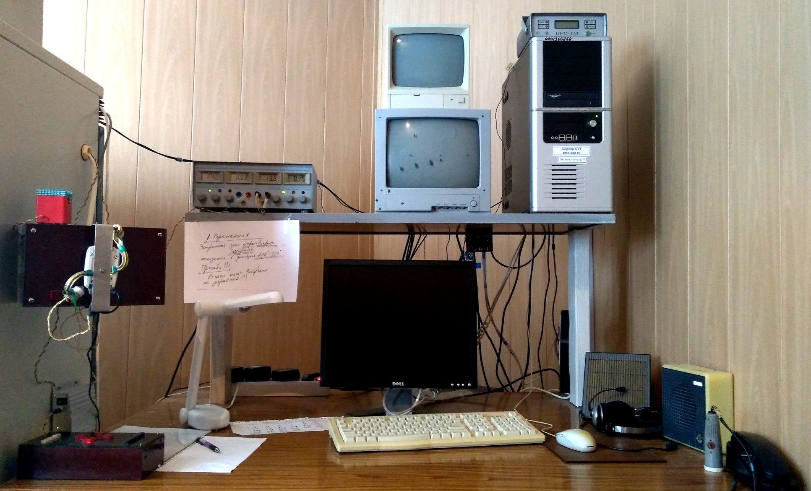
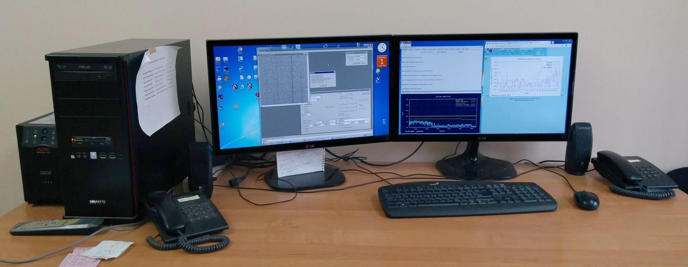

# Доступ к управлению телескопом и ПЗС-фотометром

[Назад: на стартовую страницу](index.md)

Управление ПЗС-фотометром телескопа Цейсс-1000 может осуществляться несколькими способами:

1. непосредственно из аппаратной телескопа Цейсс-1000 на ВНП с машин zobs и ztcs;

2. удалённо с машины zrobs в к.107 лабораторного корпуса САО РАН на ННП;
 

3. из любого другого места при наличии необходимых программ и организации сетевого доступа.

Распечатанные копии руководства в аппаратной Цейсс-1000 и к.107 лабораторного корпуса САО РАН снабжены
дополнительным списком логинов и паролей, необходимых для проведения наблюдений с ПЗС-фотометром
(см. Список паролей Цейсс-1000).

Индивидуальные логины и пароли доступа к Web-интерфейсам и электронным журналам раздаются ответственным за техническое состояние.
