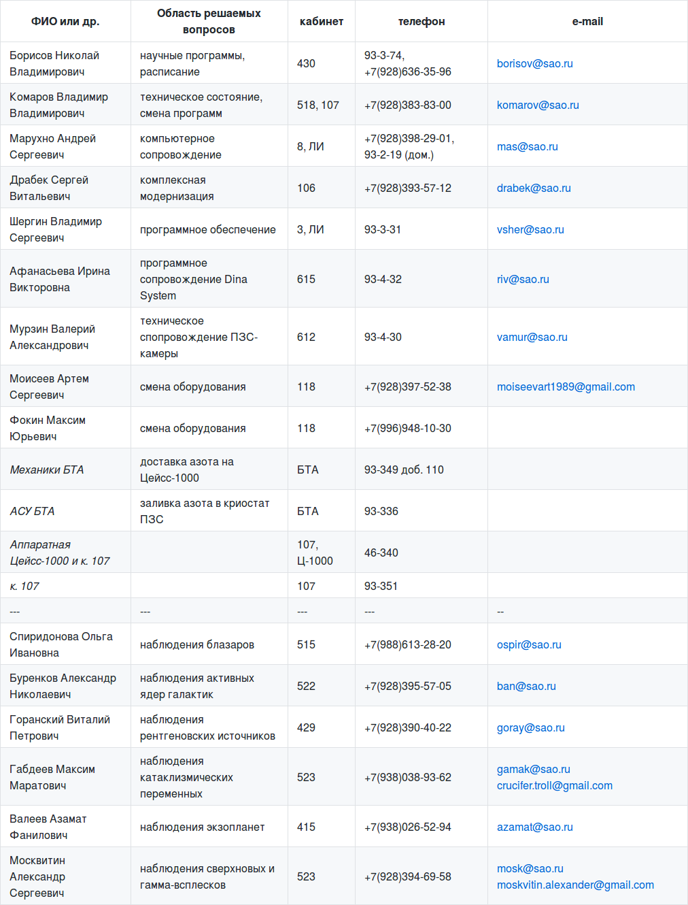

# Руководство наблюдений с ПЗС-фотометром телескопа Цейсс-1000

## Дополнительная информация

[Назад: управление питанием, нештатные ситуации, меню Dina System](Neshtat.md)

[Вверх: на стартовую страницу](index.md)

### Качество изображения из пикселей в секунды дуги

  *Графики перевода пиксельных значений качества изображения в секунды дуги для различных режимов бинирования.*

Перевод качества изображений из пиксельных значений в секунды дуги 
(для режима бинирования 2 х 2 и масштаба 0".432/pix.

   pix. | arcsec.
   ---  | ---
   2.26 | 0".98
   2.52 | 1".1 
   2.76 | 1".2 
   2.99 | 1".3 
   3.19 | 1".4 
   3.52 | 1".5 
   3.70 | 1".6 
   3.91 | 1".7 
   4.22 | 1".8 
   4.51 | 1".9 
   4.65 | 2".0 
   4.92 | 2".1 
   5.05 | 2".2 
   5.41 | 2".3 
   5.61 | 2".4 
   5.75 | 2".5 
   6.08 | 2".6 
   6.18 | 2".7 
   6.58 | 2".8 
   6.98 | 3".0 
   7.14 | 3".1 
   7.40 | 3".2 
   8.14 | 3".5 

### Контакты ответственных за состояние Цейсс-1000/ПЗС-фотометра 

                                          
Телефон аппаратной Цейсс-1000 и к. 107 запараллелен: 46-340. Из к. 107 в аппаратную Цейсс-1000 можно дозвониться с телефона ATC Definity 
93-351 набрав 046-340. 
Радиотелефон в аппаратной Цейсс-1000 -- телефон коммутатора БТА, выход на городские номера 9-46-***.

[Назад: управление питанием, нештатные ситуации, меню Dina System](Neshtat.md)

[Вверх: на стартовую страницу](index.md)

