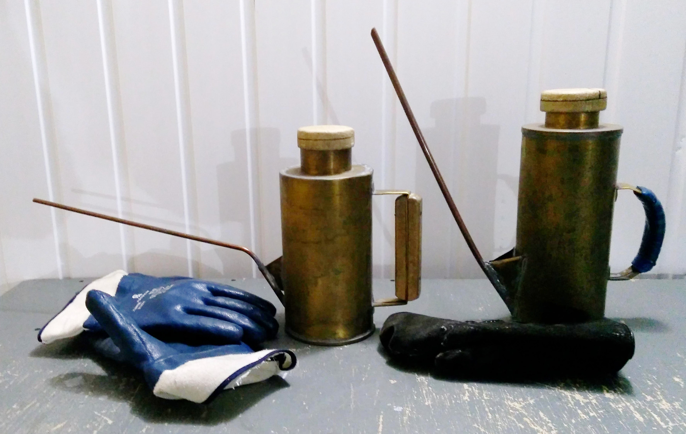

# Техническое руководство для обслуживания ПЗС-фотометра телескопа Цейсс-1000

## Заливка азота в криостат ПЗС

[Назад: управление телескопом из подкупольного пространства](InDomeControl.md)

[Вверх: на стартовую страницу](index.md)

Заливка азота на телескопе Цейс-1000 осуществляется ежедневно 2 раза в сутки: утром
 (8:00 - 9:00) и вечером (16:30 - 18:00)
 
Для заливки азота используются два типа леек: 

1. Горизонтальная

2. Вертикальная

Если криостат ПЗС располагается горизонтально, то используется 1-й тип лейки, если под углом -- 2-й.

*Горизонтальная и вертикальная лейки для заливки азота. Рукавицы и перчатки для обеспечения безопасности.*

**Процесс заливки азота:**

1. Левой рукой в рукавице взять соответствующую лейку и налить из дьюара азот до верха лейки.
2. Поднести лейку с азотом к криостату ПЗС и аккуратно вставить носик лейки до упора в отверстие для заливки азота.
3. Правой рукой плотно закрыть лейку крышкой и удерживать её до полного выхода азота из лейки в криостат. 
4. Добавлять азот в криостат ПЗС до тех пор, пока азот не начнёт выливаться из криостата.

**Предупреждение!**

1. Очень аккуратно наливать азот в лейку, что бы избежать попадания на руки и тело.
2. Не направлять носик лейки на людей и аппаратуру.
3. Держать лейку только в рукавице.
4. Не прикасаться к лейке с азотом и аппаратуре открытыми участками рук, лица и тела.

Если заливка азота происходит регулярно, то для заполнения криостата ПЗС достаточно одной полной лейки.
Если криостат ПЗС не заливали более суток, то процесс заливки азота выполнить следующим образом: 

1. Залить одну полную лейку и выждать 20 -- 30 минут.
2. Добавить 2 -- 3 лейки до полной заливки азота.

Момент полной заливки -- когда азот выливается обратно из криостата.

[Назад: управление телескопом из подкупольного пространства](InDomeControl.md)

[Вверх: на стартовую страницу](index.md)

