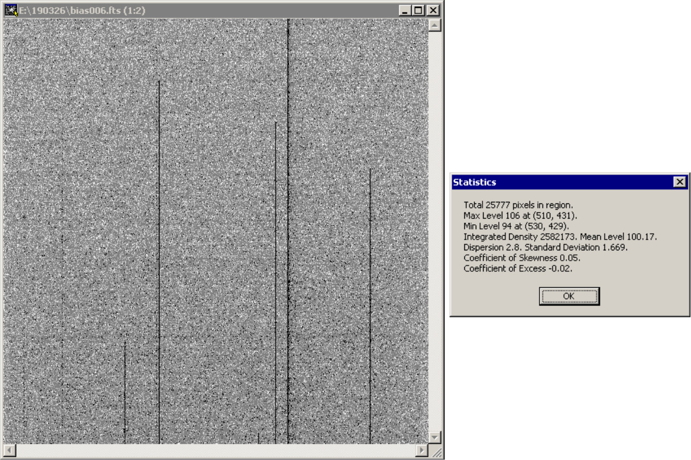

# Руководство наблюдений с ПЗС-фотометром телескопа Цейсс-1000

## Кадры электронного нуля и темнового тока

[Далее: кадры плоского поля](Flats.md)

[Назад: наведение телескопа и получение изображений в Dina System](SlewExp.md) 

[Вверх: на стартовую страницу](index.md)

### Кадры электронного нуля (bias)

Для того, чтобы корректно передать шумовые характеристики получаемых кадров, 
искусственно вводится дополнительный уровень сигнала, называемый электронным нулём (bias).
Чтобы в процессе обработки его вычесть и оставить только научно-значимый сигнал, 
отдельно снимается комплект кадров с закрытым затвором и нулевой экспозицией.
Обычно за ночь получают 5 -- 20 кадров. 
Лучше всего их получить непосредственно до и/или после основной части наблюдательной ночи, 
желательно при закрытом забрале и крышках ГЗ (чтобы избежать любой засветки).

В окне Exposure Control программы Dina System необходимо выбрать тип кадра (Observe type) bias, 
установить остальные параметры (бининг, участок кадра, считывание) согласно режиму, 
использовавшемуся при получении научных кадров.
В области окна Next file, в графе Name указать: bias, в графе Num указать 1 
(или свободный номер файла, если в директории уже есть кадры электронного нуля), 
в графе Number of exposures указать желаемое количество кадров электронного нуля.
Если в течение ночи использовались другие режимы работы камеры, 
для каждого из них нужно снять свой набор кадров электронного нуля.

Пример единичного кадра электронного нуля показан на следующем изображении. 

*Кадр электронного нуля и его статистические характеристики (в области без дефектов).*

Уровень сигнала составляет около 100 отсчётов, на кадре присутствует шум и следы дефектных столбцов матрицы.
Иногда (чаще всего в процессе выхода прибора на рабочий режим) вместо кадра электронного нуля 
с описанными свойствами получается кадр с уровнем **ровно** 100 отсчётов и без естественного шума. 
В этом случае требуется ещё раз инициализировать камеру.

### Кадры темнового тока (dark current)

 
ПЗС фотометр на основе матрицы EEV 4240 имеет относительно низкий темновой ток (dark current), 
поэтому зачастую наблюдатели ограничиваются получением калибровочных кадров электронного нуля.
Однако, если требуется очень высокая точность фотометрии, лучше снять комплекты по 5 -- 10 
кадров темнового тока (снимаются с закрытым затвором) 
для всех времён экспозиции, использовавшихся в наблюдениях, включая кадры плоского поля. 
В таком случае выбор времён экспозиции для кадров плоского поля будет ограничен несколькими значениями, 
для каждого из которых нужно получить по комплекту кадров темнового тока.

В окне Exposure Control программы Dina System необходимо выбрать тип кадра (Observe type) dark, 
в графе Name указать: dark, установить необходимую экспозицию, параметры и количество кадров.

Кадры электронного нуля и темнового тока получаются с закрытым затвором, 
поэтому положение телескопа и выставленный фильтр роли не играют.
Дабы избежать появление паразитической засветки кадров рекомендуется 
получать калибровочные кадры в темноте (при закрытом куполе).
Иногда на кадрах видны следы электромагнитных помех, желательна визуальная инспекция получаемых кадров, 
а также исключение влияния работатющих силовых агрегатов (напр., движущегося купола).

[Далее: кадры плоского поля](Flats.md)

[Назад: наведение телескопа и получение изображений в Dina System](SlewExp.md) 

[Вверх: на стартовую страницу](index.md)

