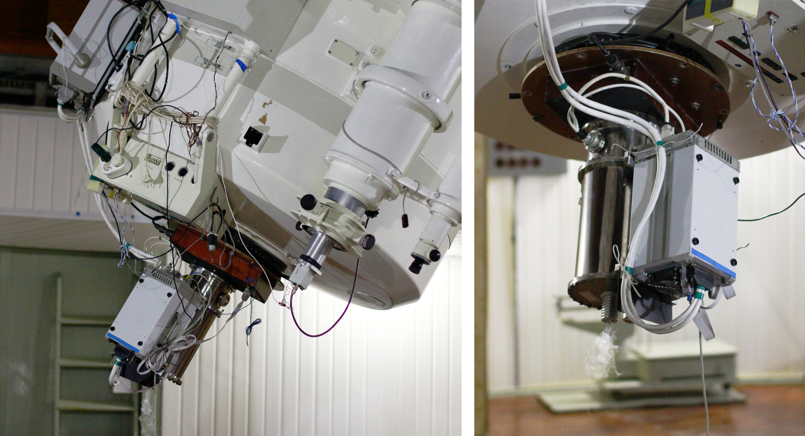

# Руководство наблюдений с ПЗС-фотометром телескопа Цейсс-1000.

### Версия 3. 2019 г. Ответственный за метод: А. С. Москвитин.

## Описание ПЗС-фотометра.

[ПЗС-фотометр][1], устанавливаемый в фокусе Кассегрена (f/13) метрового телескопа САО РАН Цейсс-1000, 
предназначен для получения прямых изображений астрономических объектов в полосах системы 
Джонсона-Коузинса: U, B, V, Rc, Ic, а также в интегральном свете без фильтра (3600 -- 10000 AA). 

Цифровые изображения астрономических объектов позволяют определять их точные положения и форму 
(для протяжённых объектов), проводить фотометрию в различных полосах с целью изучения 
распределения энергии в спектре, а также решать другие задачи. 
Множество однотипных измерений, представляющих собой кривую блеска, 
позволяют проследить динамику развития астрономических событий на временах от секунд до десятилетий, 
исследовать периоды в звёздных и планетных системах. 
Прямые изображения ощутимо дополняют другие данные об изучаемом объекте, 
позволяя сформировать цельную картину, необходимую для понимания происходящих физических процессов.

Фотометр состоит из турели с 6 позициями для фильтров и дискового затвора, 
помещённых в светозащитный корпус. 
К нижней части крепится светоприёмник с креостатом и контроллером. 
Прибор позволяет дистанционно менять фильтры, управлять затвором и параметрами светоприёмника, 
а также контролировать их состояние ([см. веб-страницу В. С. Шергина][Shergin]). 

![Квантовая эффективность ПЗС EEV 4240 и ожидаемое пропускание системы телескоп  
+ ПЗС + фильтр для полос U, B, V, Rc, Ic (кривые пропускания фильтров восстановлены на основе  
[предыдущих реализаций прибора][oldphotBTA][oldphotZeiss][Ryadch]](pic/filters_EEV4240ru.png)

[CCDphot]: https://www.sao.ru/Doc-k8/Telescopes/small/CCD/ "Информация на страничке прибора"
[Shergin]: https://www.sao.ru/hq/vsher/vsher_ru.php "Веб-страница В. С. Шергина с технической информацией о современном состоянии телескопа Zeiss-1000"
[oldphotBTA]: Кайсин С. С., Копылов А. И., Князев А. Ю.,  Шергин В. С., ПЗС-фотометр для прямых снимков в первичном фокусе 6-метрового телескопа, Отчёт САО №238, 1995.
[oldphotZeiss]: Зиньковский В. В., Кайсин С. С., Копылов А. И., Левитан Б. И., Неизвестный С. И., Тихонов Н. А., ПЗС-фотометр телескопа Цейсс-1000, Отчёт САО №231, 1994.
[Ryadch]: Рядченко В. П. Разработка ПЗС-систем и их применение в фотометрических и спектроскопических исследованиях на 6-м телескопе, диссертация к.ф.-м.н., Нижний Архыз, 1992.
[SCORPIO]: https://www.sao.ru/hq/lon/SCORPIO/scorpio.html "Афанасьев В. Л., Моисеев А. В. Универсальный редуктов светосилы Scorpio. Руководство пользователя."
[Valeev]: https://www.sao.ru/Doc-k8/Science/Public/Bulletin/Vol70/N3/ASPB336.pdf "Валеев А. Ф., Антонюк К. А., Пить Н. В., Соловьев В. Я., Бурлакова Т. Е. и др.,  
Обнаружение регулярной малоамплитудной фотометрической переменности магнитного белого карлика WD0009+501. О возможности фотометрического исследования экзопланет  
на базе телескопов метрового класса Специальной и Крымской астрофизических обсерваторий., Астрофизический Бюллетень, 70, 336, 2015."
[SCORPIOman]: www.sao.ru/hq/lon/SCORPIO/manuals/scorpio_manual_2013.pdf "Приложение С руководства для Scorpio-I  (стр. 61 - 62), подготовленное Т. А. Фатхуллиным"

