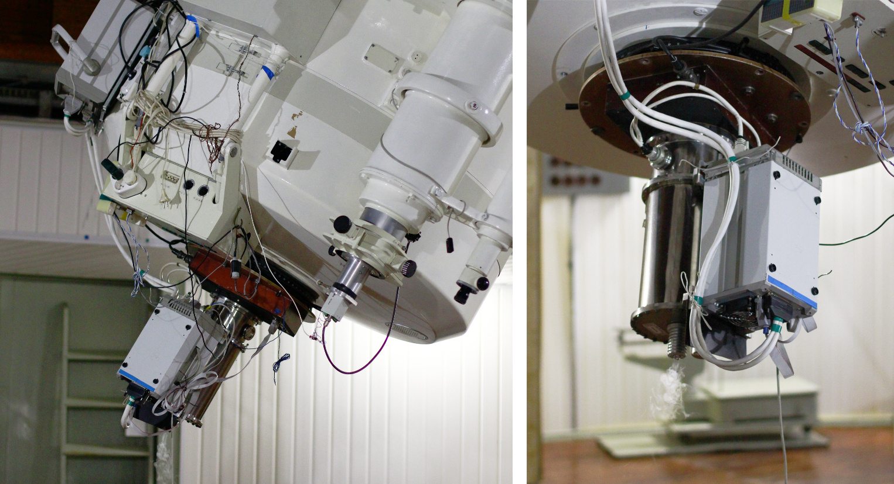
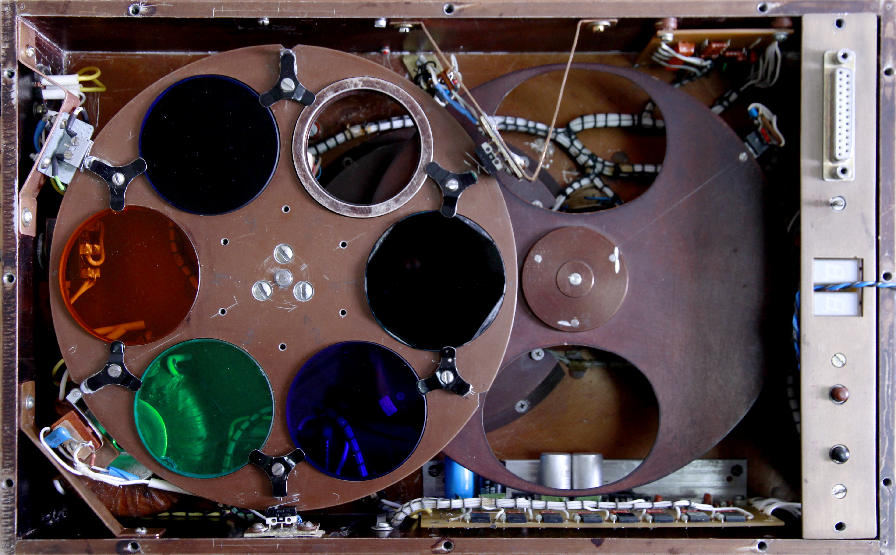
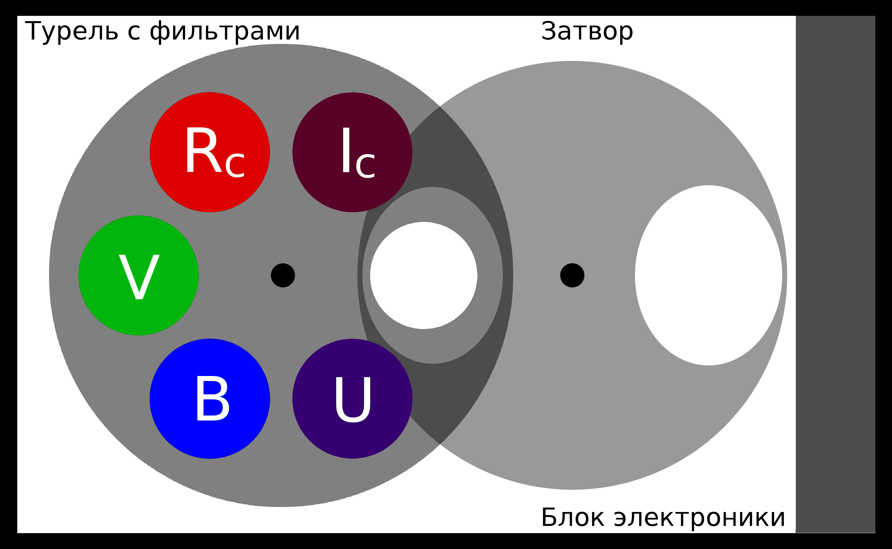
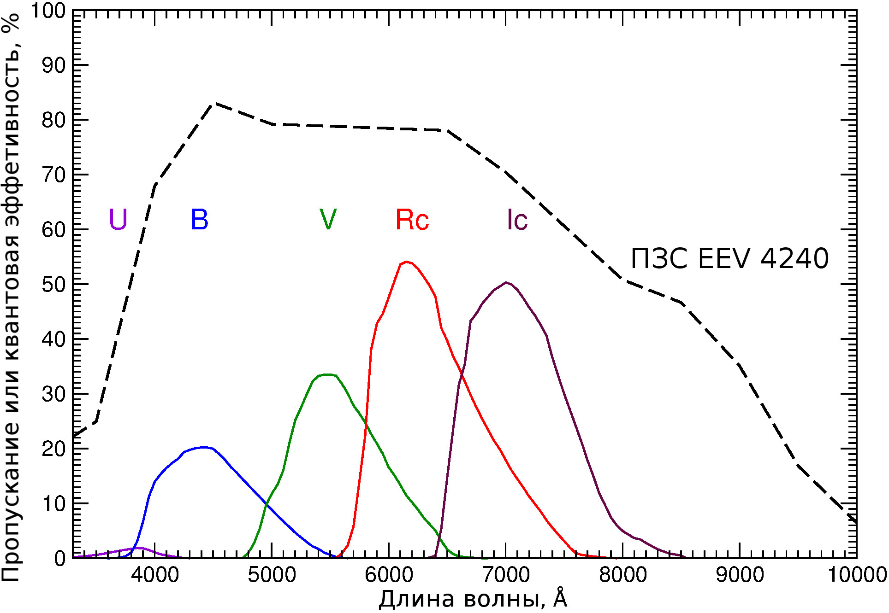
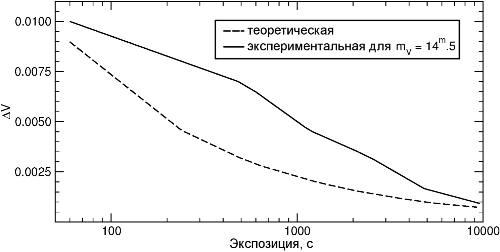

# Руководство наблюдений с ПЗС-фотометром телескопа Цейсс-1000

## Описание ПЗС-фотометра

[Далее: доступ к управлению телескопом и ПЗС-фотометром](Access.md)

[Вверх: на стартовую страницу](index.md)

[ПЗС-фотометр][CCDphot], устанавливаемый в фокусе Кассегрена (f/13.3) метрового телескопа САО РАН Цейсс-1000, 
предназначен для получения прямых изображений астрономических объектов в полосах системы 
Джонсона-Коузинса: U, B, V, Rc, Ic, а также в интегральном свете без фильтра (3600 -- 10000 AA). 

Цифровые изображения астрономических объектов, получаемые на подобных приборах, 
позволяют определять точные положения и форму источников, проводить фотометрию в различных полосах с целью изучения 
распределения энергии в спектре, а также решать другие задачи. 
Множество измерений, представляющих собой кривую блеска, 
позволяют проследить динамику развития астрономических событий на временах от секунд до десятилетий, 
исследовать периоды в звёздных и планетных системах. 
Прямые изображения ощутимо дополняют другие данные об изучаемом объекте, 
позволяя сформировать общую картину происходящих физических процессов.

*Принципиальная схема ПЗС-фотометра: турель со стеклянными фильтрами U, B, V, Rc, Ic и пустой позицией, дисковый затвор, электроника управления фотометром.*

Фотометр состоит из турели с 6 позициями для фильтров и дискового затвора, 
помещённых в светозащитный корпус. 
К нижней части крепится светоприёмник с креостатом и контроллером. 
Прибор позволяет дистанционно менять фильтры, управлять затвором и параметрами светоприёмника, 
а также контролировать их состояние. 

В качестве приёмника используется ПЗС-матрица EEV 4240 форматом 2048 х 2048  пикселей 
и максимальной квантовой эффективностью 82% (на длине волны 4500A), аналогичная применяемой с [БТА/Scorpio][SCORPIO]. 

*Квантовая эффективность ПЗС EEV 4240 и ожидаемое пропускание системы телескоп  + ПЗС + фильтр для полос U, B, V, Rc, Ic.*
*Кривые пропускания фильтров восстановлены на основе [предыдущих][oldphotBTA] [реализаций][oldphotZeiss] прибора.*

| Характеристика прибора                  |  режим                         |   значение                           |
| --- | --- | --- |
| Формат кадра ПЗС EEV 4240               |                                |   2048 x 2048 пикселей               |
| Поле зрения                             |                                |   7'.3 x 7'.3                        |
| Масштаб                                 |  без бинирования               |   0".216/пиксель                     |
| Фотометрическая система:                |                                |   Широкополосные фильтры             |
|                                         |                                |   Джонсона-Коузинса U, B, V, Rc, Ic  |
| Спектральный диапазон                   |                                |   3600 - 10000AA                     |
| Коэффициенты усиления                   |  Gain (low)                    |   2.02 e/ADU                         |
|                                         |  Gain (high)                   |   0.50 e/ADU                         |
| Шум считывания Read-out Noise           |  (normal)                      |   3.3 e                              |
| Скорость считывания кадра               |  без бинирования (1 x 1)       |   85с                                |
|                                         |  с бинированием (2 x 2)        |   28с                                |
|                                         |  с бинированием (4 x 4)        |   12с                                |
| Времена экспозиций кадров               |                                |   10 - 600                           |
| Проницание (предел 3 sigma):            |  U, 300с,  seeing = 1".5       |  20.3                                |
|                                         |  B, 300с,  seeing = 2".0       |  21.0                                |
|                                         |  V, 300с,  seeing = 1".8       |  20.3                                |
|                                         |  Rc, 300с, seeing = 2".0       |  20.3                                |
|                                         |  Ic, 300с, seeing = 1".6       |  19.4                                |
|                                         |  Rc, 3ч,  seeing  = 1".8       |  22.7                                |

Для применяемой ПЗС-матрицы в красных фильтрах (Rc, Ic) характерно появление интерференционного узора 
(fringes). Удаление этой компоненты подразумевает получение серии кадров с небольшими смещениями 
около 20". Суммарный кадр при этом будет иметь меньшую площадь, чем отдельные. 
Ввиду инертности затвора экспозиции короче 10с обычно не используются. 
Это обеспечивает уровень однородностей по полю более 99.7%. 
Реально используемое максимальное время отдельных экспозиций составляет 600 с . 

*Графики теоретической и экспериментальной точности регистрации в зависимости от времени накопления* 
*для ПЗС-фотометра телескопа Цейсс-1000. [Данные][Valeev] для звездообразного объекта 14.5 величины в фильтре V.*

Предельная звёздная величина регистрируемых объектов (проницание) в фильтре Rc за 300с: 
20.3 (seeing = 2"), за 3ч суммарной экспозиции: 22.7 (seeing = 1".8). 
Звёздные величины приведены в системе Веги.

Методика наблюдений на ПЗС-фотометре телескопа Цейсс-1000 включает этапы 
подготовки к наблюдениям, получения калибровочных кадров 
(электронного нуля или темнового тока, плоского поля), наблюдения научных объектов 
и стандартных звёзд для калибровки по абсолютным потокам. 
Обработка данных производится по стандартным алгоритмам в программных пакетах 
[IRAF](http://iraf.noao.edu/), [ESO-MIDAS](http://www.eso.org/sci/software/esomidas/) и аналогичных.

[Далее: доступ к управлению телескопом и ПЗС-фотометром](Access.md)

[Вверх: на стартовую страницу](index.md)

[CCDphot]: https://www.sao.ru/Doc-k8/Telescopes/small/CCD/ "Информация на страничке прибора"

[oldphotBTA]: https://github.com/mosksao/z1000_CCDphot/blob/main/add/238_CCDph_BTA_Kaisin_etal.pdf "Кайсин С. С., Копылов А. И., Князев А. Ю.,  Шергин В. С., ПЗС-фотометр для прямых снимков в первичном фокусе 6-метрового телескопа, Отчёт САО №238, 1995."

[oldphotZeiss]: https://github.com/mosksao/z1000_CCDphot/blob/main/add/231_CCDph_z1000_Zinkovskij_etal.pdf "Зиньковский В. В., Кайсин С. С., Копылов А. И., Левитан Б. И., Неизвестный С. И., Тихонов Н. А., ПЗС-фотометр телескопа Цейсс-1000, Отчёт САО №231, 1994."

[SCORPIO]: https://www.sao.ru/hq/lsfvo/devices/scorpio/scorpio.html "Афанасьев В. Л., Моисеев А. В. Универсальный редуктов светосилы Scorpio. Руководство пользователя."

[Valeev]: https://www.sao.ru/Doc-k8/Science/Public/Bulletin/Vol70/N3/ASPB336.pdf "Валеев А. Ф., Антонюк К. А., Пить Н. В., Соловьев В. Я., Бурлакова Т. Е. и др.,  
Обнаружение регулярной малоамплитудной фотометрической переменности магнитного белого карлика WD0009+501. О возможности фотометрического исследования экзопланет  
на базе телескопов метрового класса Специальной и Крымской астрофизических обсерваторий., Астрофизический Бюллетень, 70, 336, 2015."

[SCORPIOman]: https://www.sao.ru/hq/lsfvo/devices/scorpio/scorp_man_2012.pdf "Приложение С руководства для Scorpio-I  (стр. 71 - 72), подготовленное Т. А. Фатхуллиным"

