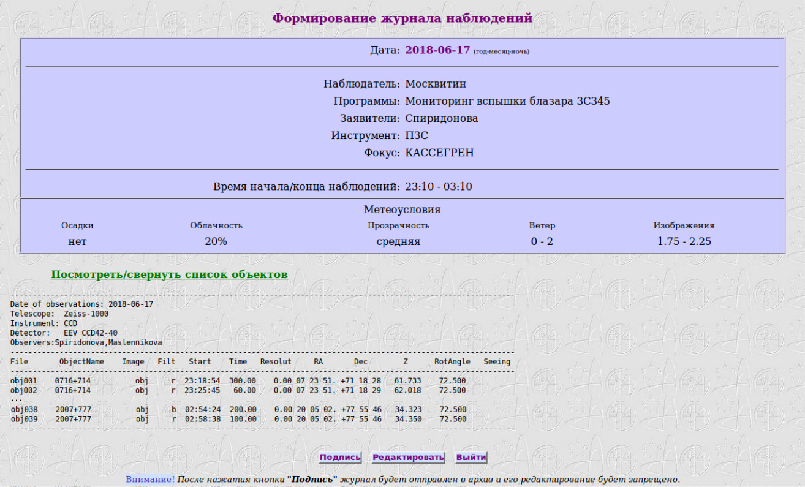

# Руководство наблюдений с ПЗС-фотометром телескопа Цейсс-1000

## Заполнение электронного журнала

[Далее: особенности прибора/телескопа и нештатные ситуации](Neshtat.md)

[Назад: завершение наблюдений](Final.md)

[Вверх: на стартовую страницу](index.md)

В конце наблюдательной ночи нужно заполнить электронный журнал, необходимый для статистики отчётов продуктивности 
телескопа. Рекомендации по заполнению находятся по адресу 
[https://www.sao.ru/ZeissLogs/help.html](https://www.sao.ru/ZeissLogs/help.html).

Для заполнения нужно ориентироваться на расписание наблюдений, 
общий бумажный журнал, 
наблюдательный лог ночи (YYMMDD.log), 
метеоусловия, 
а также измерения качества изображений, производимые во время наблюдений или уже в процессе обработки данных.

**Заполнение электронного журнала включает несколько шагов.**

1. Выйти на страничку электронных журналов [https://www.sao.ru/ZeissLogs/](https://www.sao.ru/ZeissLogs/), 
выбрать пункт "Заполнение журнала".

2. Пройти процедуру аутентификации, для этого нужно выбрать заполняемую дату и ввести ту же пару логин-пароль, 
 что и при входе в систему управления питанием телескопа и купола (система чувствительна к регистру).
 

*Страница авторизации перед заполнением электронного журнала.*
 
3.  Выбрать выполнявшиеся в течение ночи наблюдательные программы (Заявители заполняются автоматически). 
 Для этого можно сориентироваться по электронному или бумажному журналу наблюдений, либо более формально по расписанию.

4. Выбрать ПЗС в качестве инструмента, фокус Кассегрена установится автоматически.

5. По журналу заполнить моменты открытия и закрытия забрала за ночь (в случае, если наблюдения не состоялись, 
установить нулевые значения).

6. Заполнить поля с метеоусловиями (Осадки, Облачность, Прозрачность, Ветер)

7. Качество изображений (FWHM звездообразных объектов) оценивается непосредственно в процессе наблюдений 
в программе Dina System, либо в ходе обработки данных.

8. Опционально заполняется поле с комментариями.

9. Выбрать один из пунктов меню о результативности наблюдательной ночи: 

    1. "Прикрепить готовый список объектов" (если наблюдательная ночь была успешной и в Dina System создавался лог ночи), 

    2. "Заполнить список объектов вручную" (если ночь была успешной, но лога ночи по каким-то причинам не создавалось),
    
    3. "Наблюдения не состоялись по метеоусловиям", 
    
    4. "Наблюдения не состоялись по технич.причинам".

*Заполнение основных полей журнала.*

10. Нажать кнопку "Далее" внизу справа. 

11. На открывшейся странице "Прикрепление текстового файла с объектами" нажать кнопку "Browse..." 
и на локальном диске компьютера, с которого производится заполнение журнала, выбрать лог, созданный в Dina System
(лог ночи можно скачать по ftp в любом файловом менеджере с машины tb из директории ночи /Data/archives.z1000/CCD/). 
Когда имя файла отобразится с кнопкой "Browse...", нажать кнопку "Прикрепить", 
появится надпись "Файл успешно прикрепился!" и будет доступен просмотр его содержимого (можно проверить, всё ли в порядке).

*Прикрепление лога ночи, созданного в Dina System.*
 
 
12. Нажать кнопку "Далее". 

13. На открывшейся странице будет доступен предпросмотр журнала перед отправкой. 
Можно проверить все поля, и если всё в порядке, нажать кнопку "Подпись", 
или, если не в порядке, поправить значения, нажав кнопку "Редактировать".

**После нажатия кнопки "Подпись" журнал будет отправлен в архив и его редактирование будет запрещено.**

*Финальный вид электронного журнала ночи перед подписью.*

14. На открывшейся странице появится надпись: "Журнал YYYY-MM-DD помещен в архив и закрыт на редактирование", 
 и ниже кнопка "В начало", нажатие на которую завершает сессию заполнения электронного журнала.

[Далее: особенности прибора/телескопа и нештатные ситуации](Neshtat.md)

[Назад: завершение наблюдений](Final.md)

[Вверх: на стартовую страницу](index.md)

 
 

    
 
