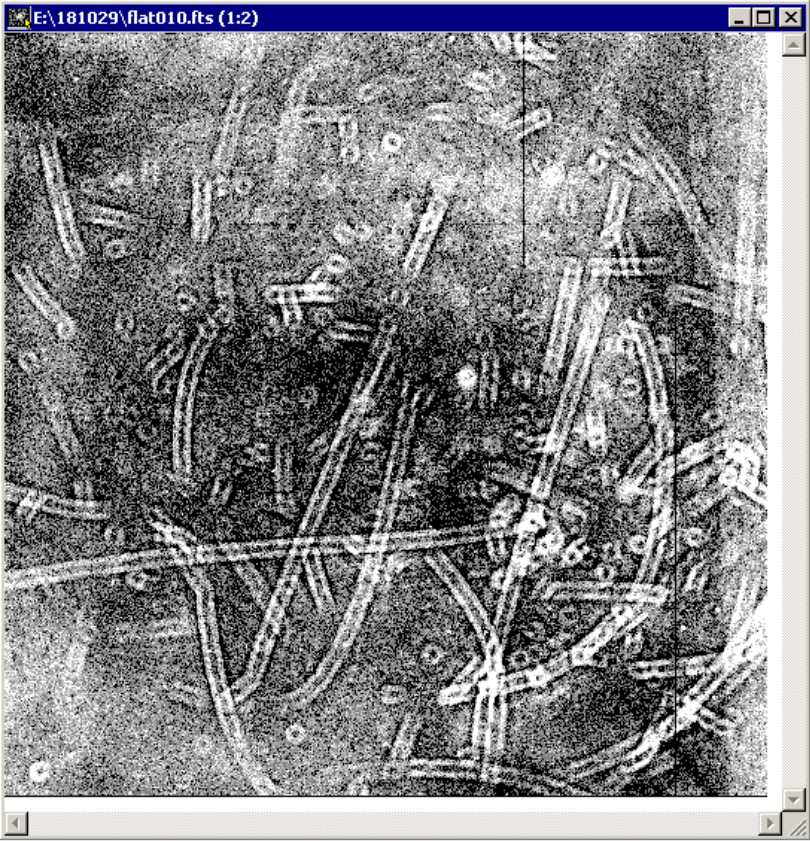

# Руководство наблюдений с ПЗС-фотометром телескопа Цейсс-1000

## Кадры плоского поля (flat field)

[Далее: фокусировка телескопа](Focus.md)

[Назад: кадры электронного нуля и темнового тока](BiasDark.md)

[Вверх: на стартовую страницу](index.md)

*Пример кадра плоского поля для ПЗС-фотометра Цейсс-1000.*

Калибровочные кадры плоского поля, необходимые для исправления неоднородности чувствительности прибора по полю, 
могут быть получены в вечерние и утренние сумерки каждой наблюдательной ночи.
Погодные условия и технические проблемы зачастую вносят свои коррективы в эту идеализированную картину. 
Обычно, одним и тем же комплектом плоских полей можно без существенных искажений обработать наблюдательные данные, 
полученные в соседние ночи.
На практике наблюдатели часто пользуются этим и получают полные комплекты плоских полей для всех 
используемых фильтров и режимов бинирования (1 x 1, 2 x 2, ...) несколько раз за сет 
(период установки прибора на телескоп).
Для наилучших результатов рекомендуется проводить обработку с помощью плоских полей, 
наблюдавшихся в тот же сет максимально близко к дате получения научных данных.

Если по каким-то техническим причинам планируется переконфигурирование прибора 
(переустановка фотометра, ПЗС или фильтров, очистка оптических поверхностей, вакуумирование камеры и т.д.), 
следуют снять полные комплекты плоских полей до и после технических работ, 
чтобы корректно обработать научные данные, полученные в разных конфигурациях.
 
 
Процесс получения плоских полей может быть проведён во время вечерних сумерек после [подготовки](Pre.md) 
или во время утренних сумерек после съёмки последнего объекта.

Оптимальная последовательность смены фильтров **U, Ic, B, V, Rc (вечером); Rc, V, B, Ic, U (утром)**.
Экспозиции плоских полей обычно лежат в пределах 10 -- 200 секунд. 
При временах экспозиции менее 10 секунд на однородность кадра начинает заметно влиять функция затвора.
**Получение плоских полей следует производить после фокусировки телескопа!**

| Blank Field |  R.A. (2000.0)   |   Decl. (2000.0) | Комментарии         |
| ----------- | ---------------  |  --------------  | ------------------  |
| BF1         |  04:29:53.4      |   +54:16:10      | звёзды в поле       |
| BF2         |  04:29:52.5      |   +24:28:08      | звёзд нет           |
| BF8*        |  12:16:02        |   +28:28:12      | звёзды в поле (О.И. 2020.11.27) |
| BF3N        |  15:53:35.0      |   -04:35:56      | звезда на краю      |
| BF3S        |  15:53:30.5      |   -04:44:29      | звёзд нет           |
| BF5         |  19:21:30.0      |   +12:28:51      | звёзды в поле       |
| BF6         |  19:26:26.5      |   +13:50:18      | звёзды в поле       |
| BF3*        |  21:29:32        |   -08:38:31      | [старый фотометр][oldphotZeiss] |
| BF7         |  23:56:50.4      |   +59:43:27      | звёзды в поле       |

*Координаты пустых площадок на небе для получения плоских полей*
*из руководств к [SCORPIO][SCORPIOman] и [старому фотометру][oldphotZeiss] Цейсс-1000*

**Процесс получения плоских полей представляется в виде следующей процедуры.**

1. Наведение на одну из доступных пустых площадок.

2. В настройках Dina System выставляется имя объекта, говорящее о том,
что снимаются плоские поля (можно указать название площадки, бинирование и т.д.), 
в окне Exposure Control тип объекта меняется на flat, название файла меняется на flat, 
нумерация с 1 (если плоские поля в данную ночь не снимались) или с N+1 номера 
(если вечером снято N кадров плоского поля), количество кадров серии 1.

3. Ожидание достаточного уровня фона сумеречного неба. 
Снимаются пробные короткие экспозиции в первом из фильтров последовательности для оценки приходящего сигнала. 
Если кадры плоского поля снимаются вечером, необходимо выставить фильтр  U или, если наблюдения в нём не проводились, то Ic. 
Когда оценка уровня фона показывает, что на 10-секундной экспозиции уровень будет в пределах 20 - 30 тысяч отсчётов, 
можно снимать первый кадр. Для утренних плоских полей выставляется фильтр Rc, оценивается примерный уровень фона 
на 200-секундной экспозиции (с учётом увеличения сигнала).

4. После удачного кадра (накопленный уровень сигнала лежит в указанных пределах)
делается небольшой сдвиг поля (около 20", в ZEISS-GUI OBS, например, через вкладку Corrections, 
поля Whole H. A. Shift и Whole Decl. Shift,  а также кнопки Set у этих полей).
Для компенсации уменьшающегося/увеличивающегося потока от сумеречного неба, при работе вечером время экспозиция 
необходимо увеличивать на 10 - 40% по сравнению с предыдущим кадром, а при утренних наблюдениях, соответственно, уменьшать.

5. Обычно в одном фильтре получают 3 - 7 кадров плоского поля (с последовательными сдвигами между ними), 
что при обработке медианой позволяет уменьшить шумы и исключить локальные неоднородности от случайных звёзд 
и следов космических частиц на одиночных кадрах плоского поля.

6. Указанные действия выполняются для всех фильтров последовательности. 
Из-за технических причин далеко не всегда удаётся снять все плоские поля за одни сумерки, 
поэтому, если условия позволяют, нужно получить полную серию кадров для двух-трёх фильтров, 
а остальные отснять в следующий раз. Если такой возможности не предвидится, 
лучше ограничиться меньшим количеством кадров (например, 3) для каждого фильтра,
но получить плоские поля для всего набора фильтров.

[Далее: фокусировка телескопа](Focus.md)

[Назад: кадры электронного нуля и темнового тока](BiasDark.md)

[Вверх: на стартовую страницу](index.md)

[oldphotZeiss]: https://github.com/mosksao/z1000_CCDphot/blob/main/add/231_CCDph_z1000_Zinkovskij_etal.pdf "Зиньковский В. В., Кайсин С. С., Копылов А. И., Левитан Б. И., Неизвестный С. И., Тихонов Н. А., ПЗС-фотометр телескопа Цейсс-1000, Отчёт САО №231, 1994."
[SCORPIOman]: https://www.sao.ru/hq/lon/SCORPIO/manuals/scorpio_manual_2013.pdf "Приложение С руководства для Scorpio-I  (стр. 61 - 62), подготовленное Т. А. Фатхуллиным"
