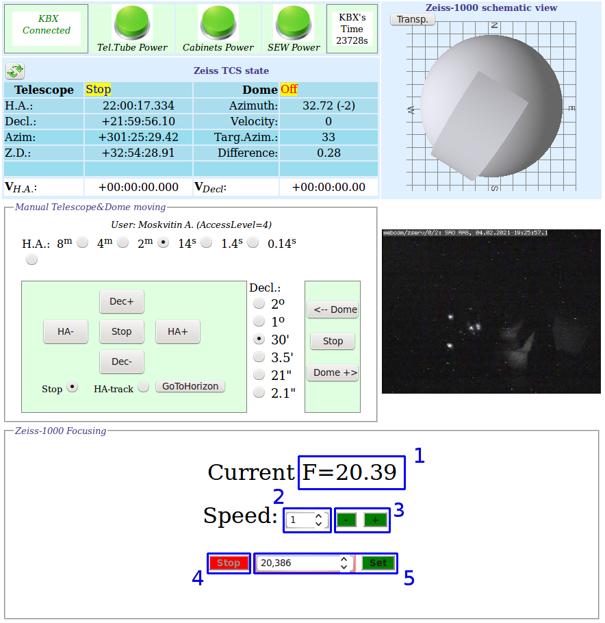

# Руководство наблюдений с ПЗС-фотометром телескопа Цейсс-1000.

## Фокусировка телескопа

[Далее: завершение наблюдений](Final.md)

[Назад: фокусировка телескопа](Focus.md)

[Вверх: на стартовую страницу](index.md)

Для выполнения операции фокусировки ознакомиться с разделом ["быстрый анализ изображений в Dina System"](SlewExp.md).

*Предварительное значение фокуса для ПЗС фотометра (по грубой шкале): 27.*

Фокусировка телескопа Цейсс-1000 \cite{Foc_Drabek} осуществляется путём перемещения вторичного зеркала. 
Его положение контролировалось с помощью сельсинов (электрических машин с индукционной связью, 
служащих для синхронного поворота или вращения осей, механически не связанных друг с другом).
С марта 2020 года вместо сельсина грубой фокусировки был установлен угловой энкодер, двигатель фокусировки 
подключён через частотный привод. Управление фокусом осущёствляется через веб-интерфейс на странице
[ztcs.sao.ru/~eddy/](https://ztcs.sao.ru/~eddy/), продублированый на 
[странице управления телескопом, куполом и крышками зеркала](ztcs.sao.ru/tcs/zeiss_moxa_new.php).

*Веб-интерфейс управления фокусом телескопа Цейсс-1000.*

Основные группы интерфейса:

1. Отображение текущего значения фокуса (в мм с округлением до сотых)* 

2. Выбор одной из скоростей (1..4) для ручного управления фокусом.

3. Кнопки ручного управления фокусом: механизм фокусировки движется в сторону "-" или "+"
со скоростью, выбранной в п.2. Движение происходит до тех пор, пока нажата кнопка "-" или "+".

4. Остановка перемещения фокуса при автоматической установке на заданное значение.

5. Автоматическая установка фокуса на заданное значение. Введите в левом поле необходимое значение фокуса,
затем нажмите кнопку "Set". 
Вручную корректировать люфт не нужно: фокусёр всегда подходит к заданной позиции со стороны бОльших значений фокуса F.

**Внимание!** 

На данный моммент передвижение механизма фокусировки на минимальной скорости (220 об./мин.) может заклинивать, 
поэтому в интерфейсе скорость "1" в ручном режиме не будет работать, а все тонкие перемещения выполняются
на скорости 350 об./мин., что может приводить к погрешности установки фокусёра более 0.1 мм.

## Процедура фокусировки

Для хорошей фокусировки желательно уравновесить температуру подкупольного пространства с наружной. 
Для этого необходимо заблаговременно открыть забрало телескопа.
Значение фокуса зависит от температуры телескопа, которая меняется как от сезона к сезону, так и в течение ночи. 
Получение точной закономерности затруднено вследствие нескольких факторов:

- люфты фокусировочного механизма; 

- изменение характеристик атмосферы во время фокусировки;

- неточности определения минимума фокусировочной кривой;

