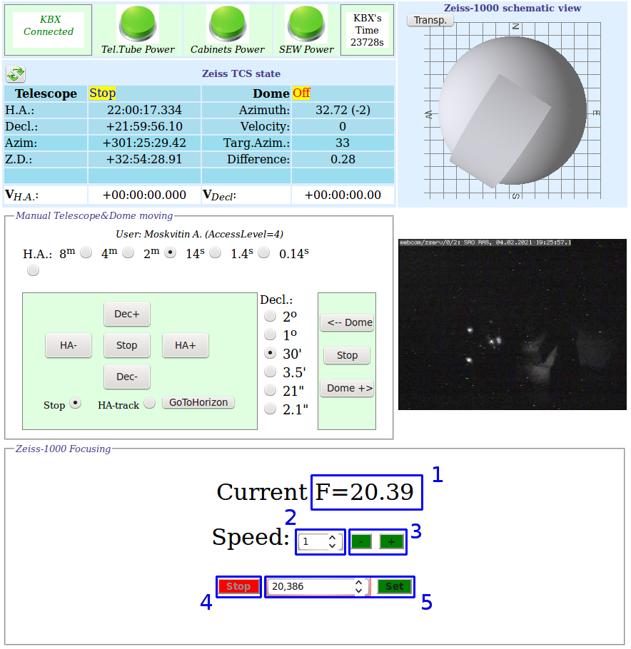
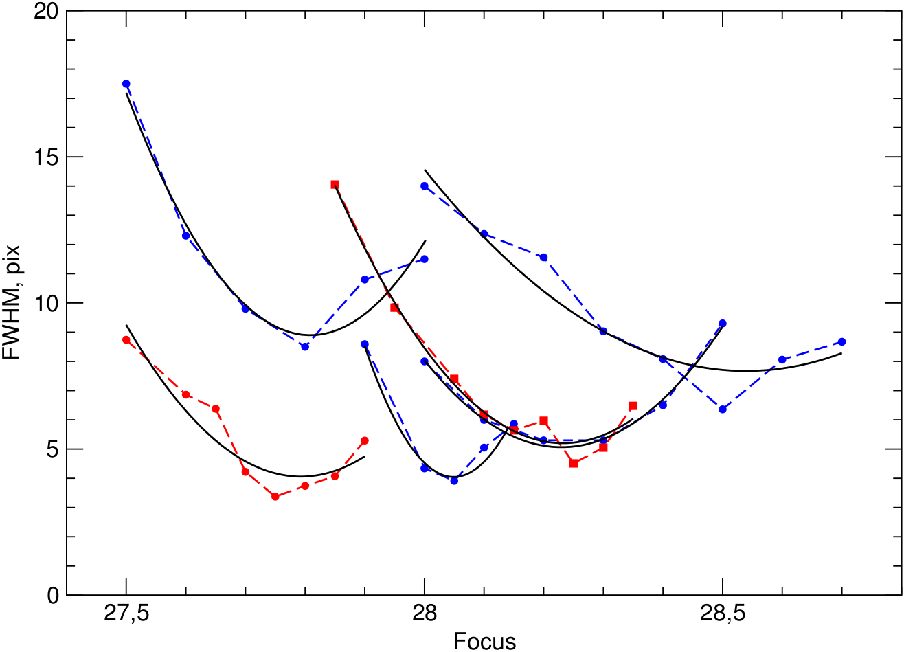

# Руководство наблюдений с ПЗС-фотометром телескопа Цейсс-1000

## Фокусировка телескопа

[Далее: завершение наблюдений](Final.md)

[Назад: кадры плоского поля](Flats.md)

[Вверх: на стартовую страницу](index.md)

Для выполнения операции фокусировки ознакомиться с разделом ["Быстрый анализ изображений в Dina System"](SlewExp.md).

**Предварительное значение фокуса для ПЗС фотометра (по грубой шкале): около 27 - 28.**

[Фокусировка][Foc_Drabek] телескопа Цейсс-1000 осуществляется путём перемещения вторичного зеркала. 
Его положение контролировалось с помощью сельсинов (электрических машин с индукционной связью, 
служащих для синхронного поворота или вращения осей, механически не связанных друг с другом).
С марта 2020 года вместо сельсина грубой фокусировки был установлен угловой энкодер, двигатель фокусировки 
подключён через частотный привод. Управление фокусом осущёствляется через веб-интерфейс на странице
[ztcs.sao.ru/~eddy/](https://ztcs.sao.ru/~eddy/), продублированый на 
[странице управления телескопом, куполом и крышками зеркала](https://ztcs.sao.ru/tcs/zeiss_moxa_new.php).

*Веб-интерфейс управления фокусом телескопа Цейсс-1000.*

Основные группы интерфейса:

1. Отображение текущего значения фокуса (в мм с округлением до сотых).

2. Выбор одной из скоростей (1..4) для ручного управления фокусом.

3. Кнопки ручного управления фокусом: механизм фокусировки движется в сторону "-" или "+"
со скоростью, выбранной в п.2. Движение происходит до тех пор, пока нажата кнопка "-" или "+".

4. Остановка перемещения фокуса при автоматической установке на заданное значение.

5. Автоматическая установка фокуса на заданное значение. Введите в левом поле необходимое значение фокуса,
затем нажмите кнопку "Set". 
Вручную корректировать люфт не нужно: фокусёр всегда подходит к заданной позиции со стороны бОльших значений фокуса F.

**Внимание!** 

На данный моммент передвижение механизма фокусировки на минимальной скорости (220 об./мин.) может заклинивать, 
поэтому в интерфейсе скорость "1" в ручном режиме не будет работать, а все тонкие перемещения выполняются
на скорости 350 об./мин., что может приводить к погрешности установки фокусёра более 0.1 мм.

Для хорошей фокусировки желательно уравновесить температуру подкупольного пространства с наружной. 
Для этого необходимо заблаговременно открыть забрало телескопа.
Значение фокуса зависит от температуры телескопа, которая меняется как от сезона к сезону, так и в течение ночи. 
Получение точной закономерности затруднено вследствие нескольких факторов:

- люфты фокусировочного механизма; 

- изменение характеристик атмосферы во время фокусировки;

- неточности определения минимума фокусировочной кривой;

## Процедура фокусировки

1. Для фокусировки телескоп необходимо навести на любое поле, близкое в данный момент к зениту, 
предпочтительно с яркими звёздами.

2. **Предварительная фокусировка.**
Если фокусировка производится в первую наблюдательную ночь сета, после установки прибора, 
в нижней форме веб-страницы [ztcs.sao.ru/tcs/zeiss_moxa_new.php](https://ztcs.sao.ru/tcs/zeiss_moxa_new.php)
необходимо установить *предварительное значение фокуса*, получить короткую экспозицию (20 секунд) 
и увидеть на кадре расфокусированные звёзды. 
Если объектов в поле не обнаруживается, возможны следующие причины: 

     1. свет от объектов не доходит до камеры (проверить совмещение трубы и забрала, срабатывание затвора, 
     правильность работы вводимых/выводимых элементов прибора);
     
     2. в поле нет ярких звёзд (можно проверить их наличие в поле по изображению с гида Цейсс-1000);
     
     3. текущее показание фокуса сильно отличается от необходимого (сигнал от очень расфокусированных 
     звёзд не успевает накопиться в течение короткой экспозиции).

3.  Нужно произвольно выбрать направление движения фокуса (в сторону увеличения или уменьшения), 
предварительную фокусировку продолжить, чтобы торообразные изображения звёзд  ("бублики")
начали собираться в более компактные пятна. На разрезе звезды (см. ["Быстрый анализ изображений в Dina System"](SlewExp.md))
профиль должен стать колоколообразным 
с выраженным центральным максимумом. 
Если при движении фокуса FWHM и размеры звёзд на нескольких последовательных кадрах однозначно увеличиваются, 
нужно сменить направление движения. После проведения процедуры предварительной фокусировки можно начать точную фокусировку. 
 
4.  **Точная фокусировка.** Необходимо построить фокусировочную кривую зависимости качества изображений (FWHM) 
от показаний фокуса, найти минимум FWHM и установить значение фокуса, соответствующее этому минимуму.

5. Если точная фокусировка в идущем сете (в данную или предыдущие ночи) уже проводилась, 
то можно использовать текущее значение фокуса в качестве отправной точки.
Нужно сделать короткую экспозицию (20 секунд) для заданного отсчёта фокуса. 
 Оценить качество изображений звёзд поля (параметр FWHM). 
 Далее произвольно выбрать направление движения фокусёра (в сторону увеличения или уменьшения).
Последовательно увеличивая (уменьшая) фокус по 0.1 мм, получить серию изображений.
 Оценить качество изображений звёзд поля на каждом. 
 
6. При движении фокуса FWHM звёзд будет уменьшаться (изображения звёзд станут компактнее), 
 в районе какого-то значения фокуса FWHM звёзд будет минимален (оптимальная фокусировка), 
 после этого изображения звёзд будут ухудшаться.
 Если при движении фокуса в выбранном направлении FWHM и размеры звёзд на нескольких последовательных кадрах увеличиваются,
нужно сменить направление движения фокуса.

7. По результатам проведения серии изображений необходимо построить фокусировочную кривую и определить её минимум. 
Ему будет соответствовать оптимальное значение фокуса. 

*Примеры фокусировочных кривых, полученных во время наблюдений с ПЗС фотометром.*
*Для определения минимумов вписаны параболы.*

8. Ввиду существующих люфтов фокусировочного механизма, значение оптимального фокуса нужно выставить следующим образом.
 Если во время получения серии кадров фокус двигался вверх, то помощью кнопки "+" нужно выставить значение фокуса 
 немного выше желаемого, а потом уменьшить его до необходимой отметки кнопкой "-". 
В автоматическом режиме установки этот шаг необходимо пропустить, 
так как фокусёр будет подходить к заданной позиции со стороны бОльших значений фокуса F.

9. При нестабильном небе, возможно, потребуется повторить фокусировку, поскольку кривая зависимости качества изображений 
от показаний фокусёра имеет плохо выраженный и зашумлённый флуктуациями минимум. 

10. При очень хорошем качестве изображений, возможно, потребуется более точная итерация процесса фокусировки 
с шагом 0.05 мм вблизи минимума фокусировочной кривой.
 

[Далее: завершение наблюдений](Final.md)

[Назад: кадры плоского поля](Flats.md)

[Вверх: на стартовую страницу](index.md)

[Foc_Drabek]: https://github.com/mosksao/z1000_CCDphot/tree/main/add/334_Drabek_z1000_Focus.pdf "Драбек С. В., Комаров В. В., Исследование фокусировки телескопа Цейсс-1000, Отчёт САО № 334, 2016"

