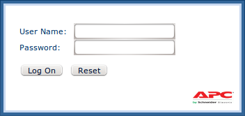
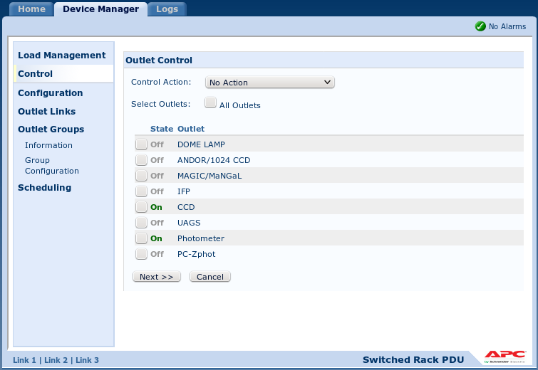
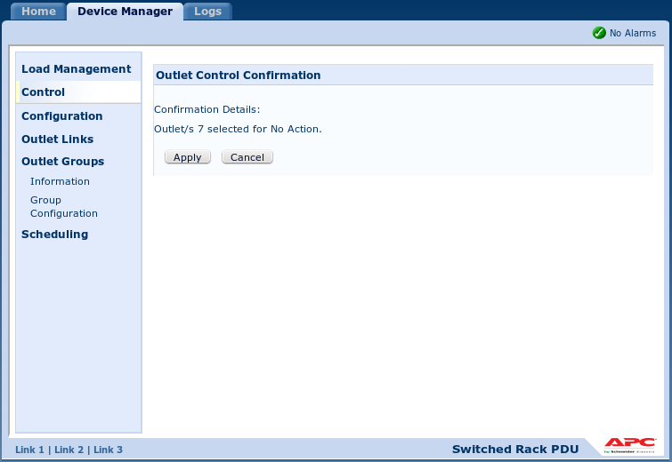

# Руководство наблюдений с ПЗС-фотометром телескопа Цейсс-1000

## Особенности прибора/телескопа и нештатные ситуации

[Далее: качество изображений в пикселях и угловых секундах](Scale.md)

[Назад: заполнение электронного журнала](EJ.md)

[Вверх: на стартовую страницу](index.md)

### Управление питанием на трубе телескопа (удалённая розетка)

**Питание трубы телескопа больше не отключать!**
При отключении питания трубы телескопа отключится IP-розетка и при включении на её портах не будет 220 В.

Контроль питания приборов на трубе телескопа Цейсс-1000 осуществляется с помощью 
переключаемого блока распределения питания (Switched Rack Power Distribution Unit).

**Для перезагрузки питания прибора (фотометра, ПЗС-камеры или др.) необходимо выполнить ряд шагов.**

1. В браузере выйти на страницу [zpower3.sao.ru/](zpower3.sao.ru/), ввест логин/пароль,
нажать кнопку "Log on" для входа в консоль управления.

2. Открываем **Device Manager**, в панели подкатегорий выбираем **Control**.
Напротив работающих приборов стоят зелёные значки "On", отключённые приборы отображены серыми значками "Off".

3. Для перезагрузки питания ставим галочку напротив фотометра (7 порт **Photometer** в списке),
выбираем в строке всплывающего верхнего меню "Control action" действие "Off Immediate" и нажимаем кнопку "Next >>".

4. В открывшемся окне подтверждаем действие, нажав кнопку "Apply". 

5. После подтверждения появляется окно управления питанием, но с внесённым изменением: напротив фотометра будет
статус "Off". 

6. Перед включением питания следует выждать несколько секунд.
Снова ставим галочку напротив фотометра выбираем в меню "Control action" действие "On Immediate" 
и нажимаем кнопку "Next >>".

7. В открывшемся окне подтверждаем действие, нажав кнопку "Apply". Питание фотометра перезапущено.
Для выхода из системы управления питанием нажать Log Off в правом верхнем углу формы.

### Нештатные ситуации

И телескоп и ПЗС-фотометр являются неидеальными приборами с рядом особенностей, 
которые необходимо учитывать в процессе эксплуатации.
Нередко с оборудованием возникают нештатные ситуации, часть из которых имеет эффективные решения.

1. **Зависание Dina System.** 
Иногда программа управления фотометром подвисает и перестаёт отвечать на действия наблюдателя. 
Решением в данном случае является принудительное закрытие программы, её повторный запуск и инициализация камеры 
(меню Camera --> Init Camera).  Следует отметить, что после перезагрузки необходимо восстановить запись имени объекта 
(меню Camera --> Change Current FITS Header).
 
2. **Несколько запущенных окон Dina System.** 
Если Dina System работает нестабильно, следует проверить, 
не запущено ли несколько её окон. Для этого на zobs нужно вызвать диспетчер задач Windows (taskmgr,
при работе удалённо через Radmin нажать кнопку "Передача Ctrl-Alt-Del") 
и проверить в приложениях и процессах количество запущенных программ Dina System.
При наличии нескольких запущенных версий, остановить их все и запустить Dina System заново.

3. **Зависание фотометра при смене фильтров.**
Иногда при смене фильтров экспозиция не начинается, а программа Dina System зависает.
Решением является выключение/включение питания фотометра с помощью удалённой розетки.
После этого произвести перезапуск Dina System и инициализацию камеры.
 
4. **Засветка кадра.** 
Возникновение необычной засветки на кадре может быть связано с включённой на фотометре индикацией положения турели 
и состояния затвора. Обычно ответственные за установку прибора выключает эту индикацию, но не всегда.
Это предположение можно проверить по наличию источника света от фотометра на камере подкупольного пространства.

5. **Появление дополнительных дефектных столбов на кадре и ухудшение его качества.** 
Проверить температуру камеры, если она выше -129 градусов Цельсия, необходима заливка азота. 
Если ситуация возникла в течение ночи, необходимо остановить наблюдения, сообщить о случившемся ответственному инженеру. 
После заливки азота дождаться выхода матрицы на рабочий режим, провести процесс инициализации (возможно, несколько раз) 
и продолжить наблюдения.

6. **Появление мутного пятна в центре кадра.** 
Иногда при высокой влажности и выключенном подогреве защитного стекла матрицы, на нём возникает выпадение конденсата, 
что вызывает помутнение кадра начиная с его центра. В таком случае следует сообщить о проблемах ответственному инженеру 
и попросить проверить включение блока подогрева.
 
7. **Растягивание звёзд.**
При наблюдениях объектов после кульминации (при движении телескопа на юго-запад) возможно растяжение изображений 
вдоль часового угла на экспозициях 300 -- 600 секунд. Это связано с дефектом механики телескопа. 
Решением проблемы будет избегание данной области в планировании наблюдений.

8. **Особенности фокусировки.** Недостатками фокусировочного узла можно назвать люфт фокусёра.
 Общие рекомендации: снимать показания в одном направлении движения фокуса.
 Также было замечено, что при положительной температуре, в случае её увеличения, 
 фокус нужно уменьшать (примерно на 0.05 мм при изменениях в несколько градусов Цельсия). 
 Важно, чтобы телескоп изначально был хорошо сфокусирован.
 При отрицательных температурах закономерностей выявить не удалось.
 Направление движения фокуса можно также проследить по профилю звёзд. 
 Если правое крыло профиля звезды более полого, нежели левое, нужно уменьшать фокус. 
 
9. **Особенности купола и забрала.** Для избежания возникновения поломок, открытие забрала производится 
в оговоренной доступной области, существуют запрещённые зоны (о них нужно спросить у ответственного инженера 
или наблюдателей). Забрало необходимо оставлять в одном из крайних положений (либо полностью открыто, 
либо полностью закрыто). Так как автоматика открытия/закрытия забрала иногда не отрабатывает полностью, 
необходимо визуально контролировать не только появление соответствующих сообщений в статусе и на схемах купола/телескопа, 
но и визуально оценивать вид проёма забрала по камерам подсмотра, а также фиксировать звук схлопывающихся створок.

**Одновременное открытие забрала и движение купола запрещены!**

[Далее: качество изображений в пикселях и угловых секундах](Scale.md)

[Назад: заполнение электронного журнала](EJ.md)

[Вверх: на стартовую страницу](index.md)

 
 
