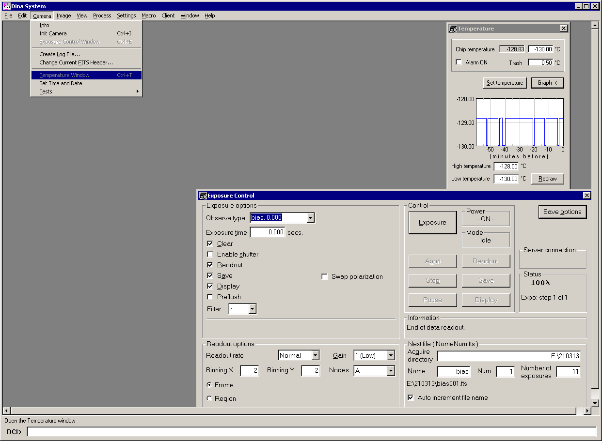

# Руководство наблюдений с ПЗС-фотометром телескопа Цейсс-1000

## Управление питанием, нештатные ситуации, меню Dina System

[Далее: дополнительная информация](AddInfo.md)

[Назад: заполнение электронного журнала](EJ.md)

[Вверх: на стартовую страницу](index.md)

### Управление питанием на трубе телескопа (удалённая розетка)

**Питание трубы телескопа больше не отключать!**
При отключении питания трубы телескопа отключится IP-розетка и при включении на её портах не будет 220 В.

Контроль питания приборов на трубе телескопа Цейсс-1000 осуществляется с помощью 
переключаемого блока распределения питания (Switched Rack Power Distribution Unit).

**Для перезагрузки питания прибора (фотометра, ПЗС-камеры или др.) необходимо выполнить ряд шагов.**

1. В браузере выйти на страницу [zpower3.sao.ru/](http://zpower3.sao.ru/), ввести логин/пароль,
нажать кнопку "Log on" для входа в консоль управления.

2. Открываем **Device Manager**, в панели подкатегорий выбираем **Control**.
Напротив работающих приборов стоят зелёные значки "On", отключённые приборы отображены серыми значками "Off".

3. Для перезагрузки питания ставим галочку напротив фотометра (7 порт **Photometer** в списке),
выбираем в строке всплывающего верхнего меню "Control action" действие "Off Immediate" и нажимаем кнопку "Next >>".

4. В открывшемся окне подтверждаем действие, нажав кнопку "Apply". 

5. После подтверждения появляется окно управления питанием, но с внесённым изменением: напротив фотометра будет стоять статус "Off". 

6. Перед включением питания следует выждать несколько секунд.
Снова ставим галочку напротив фотометра выбираем в меню "Control action" действие "On Immediate", нажимаем кнопку "Next >>".

7. В открывшемся окне подтверждаем действие, нажав кнопку "Apply". Питание фотометра перезапущено.
Для выхода из системы управления питанием нажать Log Off в правом верхнем углу формы.

### Нештатные ситуации

И телескоп и ПЗС-фотометр являются неидеальными приборами с рядом особенностей, 
которые необходимо учитывать в процессе эксплуатации.
Нередко с оборудованием возникают нештатные ситуации, часть из которых имеет эффективные решения.

1. **Зависание Dina System.** 
Иногда программа управления фотометром подвисает и перестаёт отвечать на действия наблюдателя. 
Решением в данном случае является принудительное закрытие программы, её повторный запуск и инициализация камеры 
(меню Camera --> Init Camera).  Следует отметить, что после перезагрузки необходимо восстановить запись имени объекта 
(меню Camera --> Change Current FITS Header).
 
2. **Несколько запущенных окон Dina System.** 
Если Dina System работает нестабильно, следует проверить, 
не запущено ли несколько её окон. Для этого на zobs нужно вызвать диспетчер задач Windows (taskmgr,
при работе удалённо через Radmin нажать кнопку "Передача Ctrl-Alt-Del") 
и проверить в приложениях и процессах количество запущенных программ Dina System.
При наличии нескольких запущенных версий, остановить их все и запустить Dina System заново.

3. **Зависание фотометра при смене фильтров.**
Иногда при смене фильтров (чаще всего фильтра B, иногда U или V) экспозиция не начинается, а программа Dina System зависает.
Решением является выключение/включение питания фотометра с помощью удалённой розетки.
После этого произвести перезапуск Dina System и инициализацию камеры.

4. **Не срабатывает затвор и смена фильтров.**
Иногда возникает ситуация, когда после накопления экспозиции на кадре не видно звёзд, 
а наблюдаемая картина напоминает кадр темнового тока или электронного нуля. 
Это может произойти сразу после установки прибора, поэтому идентификация состояния может быть осложнена
отсутствием фокуса, плохой погодой, уверенности в согласовании телескопа и забрала и другими факторами.
При этом Dina System не выдаёт никаких ошибок, экспозиции и смену фильтров программа якобы производит.
Важной деталью является **отсутствие задержки во время смены фильтров**. 
Обычно для смены соседних фильтров требуется пара секунд, максимальное время доходит до десятка секунд.
Для устранения неполадки можно попытаться выкл./вкл. питание фотометра, но это может не сработать.
В качестве следующего шага для устранения проблемы можно подняться в подкупольное телескопа 
и убедиться, что на фотометр подаётся питание (см. раздел [Установка ПЗС-фотометра](Setupv3.md) 
тумблер d на рисунке "Установка фотометра и ПЗС." должен быть переключен в положение **от** предохранителя).
Также для начала необходимо проверить, вращается ли турель с фильтрами и срабатывает ли затвор (см. пункт 8 того же раздела).
Если проблема была в питании, проверить, работает ли контроль смены фильтров и затвора из Dina System.
Если индикация отображает смену фильтров и работу затвора (что также сопровождается звуком), но из Dina System контроль
не восстановлен, можно выкл./вкл. тумблер блока питания (БП), закреплённого на трубе (тумблер находится сверху, рядом с кабелем), 
выкл./вкл. питания фотометра, после этого проверить контроль смены фильтров и затвора из Dina System.
Если это тоже не помогло, возможно, проблема в плохом соединении проводов.
Необходимо аккуратно подвигать разъёмы прибора, не вынимая их из гнёзд, снова произвести выкл./вкл. тумблеров БП и фотометра.
Обычно это помогает.
 
5. **Засветка кадра.** 
Возникновение необычной засветки на кадре может быть связано с включённой на фотометре индикацией положения турели 
и состояния затвора. Обычно ответственные за установку прибора выключает эту индикацию, но не всегда.
Это предположение можно проверить по наличию источника света от фотометра на камере подкупольного пространства.

6. **Появление дополнительных дефектных столбов на кадре и ухудшение его качества.** 
Проверить температуру камеры, если она выше -129 градусов Цельсия, необходима заливка азота. 
Если ситуация возникла в течение ночи, необходимо остановить наблюдения, сообщить о случившемся ответственному инженеру. 
После заливки азота дождаться выхода матрицы на рабочий режим, провести процесс инициализации (возможно, несколько раз) 
и продолжить наблюдения.

7. **Появление мутного пятна в центре кадра.** 
Иногда при высокой влажности и выключенном подогреве защитного стекла матрицы, на нём возникает выпадение конденсата, 
что вызывает помутнение кадра начиная с его центра. В таком случае следует сообщить о проблемах ответственному инженеру 
и попросить проверить включение блока подогрева.
 
8. **Растягивание звёзд.**
При наблюдениях объектов после кульминации (при движении телескопа на юго-запад) возможно растяжение изображений 
вдоль часового угла (по горизонтали) на экспозициях 300 - 600 секунд. Это связано с дефектом механики телескопа. 
Решением проблемы будет избегание данной области при наблюдениях.

9. **Особенности фокусировки.** Недостатками фокусировочного узла можно назвать люфт фокусёра.
 Общие рекомендации: снимать показания в одном направлении движения фокуса.
 Также было замечено, что при положительной температуре, в случае её увеличения, 
 фокус нужно уменьшать (примерно на 0.05 мм при изменениях в несколько градусов Цельсия). 
 Важно, чтобы телескоп изначально был хорошо сфокусирован.
 При отрицательных температурах закономерностей выявить не удалось.
 Направление движения фокуса можно также проследить по профилю звёзд. 
 Если правое крыло профиля звезды более полого, нежели левое, нужно уменьшать фокус. 
 
10. **Особенности купола и забрала.** Для избежания возникновения поломок, открытие забрала производится 
в оговоренной доступной области, существуют запрещённые зоны (о них нужно спросить у ответственного инженера 
или наблюдателей). Забрало необходимо оставлять в одном из крайних положений (либо полностью открыто, 
либо полностью закрыто). Так как автоматика открытия/закрытия забрала иногда не отрабатывает полностью, 
необходимо визуально контролировать не только появление соответствующих сообщений в статусе и на схемах купола/телескопа, 
но и визуально оценивать вид проёма забрала по камерам подсмотра, а также фиксировать звук схлопывающихся створок.

**Одновременное открытие забрала и движение купола запрещены!**

### Меню и настройки Dina System

Камера ПЗС-фотометра может использоваться для спектроскопических наблюдений с приборами UAGS и CEGS,
при этом настройки Dina System могут быть изменены. Для их восстановления можно воспользоваться
приведёнными снимками различных пунктов меню. 
Подробное описание можно найти в последнем пункте меню помощь, а также в [документации](add/DSman.pdf),
предоставленной [Лабораторией перспективных разработок САО РАН](https://www.sao.ru/hq/adlab).

#### Первые пункты меню: File, Camera, Image, View, Process

*В меню File имеются пункты открыть изображение Image, сохранить Save As (используется, если нужно спасти перезаписанный кадр),*
*просмотр содержимого шапки изображения FITS Header, выход из программы Exit и др.*

*В меню Camera часто используются пункты инициализации камеры при зависании прибора Init Camera (см. разделы*
*Подготовка системы управления Dina System [Подготовка к наблюдениям](Pre.md) и [Тестирование работы фотометра](TestCCDphot.md)),*
*Create Log File для создания лога ночи (см. [Завершение наблюдений](Final.md)), смену содержимого шапки FITS-файла*
*Change Current FITS Header (см. [Наведение телескопа и получение изображений в Dina System](SlewExp.md)).*

*Пункты меню Process доступны из контекстного меню, хорошо описаны в подразделе Быстрый анализ изображений в Dina System* 
*раздела [Наведение телескопа и получение изображений в Dina System](SlewExp.md), а также в Help программы.*

#### Меню настроек Settings

Выбор пункта меню Settings --> Preferences позволяет открыть окно с настройками программы, в котором имеется несколько вкладок.

*Наиболее часто используемая из вкладок: General. Здесь задаются пути к рабочим директориям и параметры имени создаваемого файла.*
*Далее приведены остальные вкладки, необходимые для восстановления необходимой работоспособности программы.*

#### Палитры Palette

В Dina System можно задать различные палитры отображения получаемых кадров,
наиболее часто используемой из которых являются INVERS (чёрно-белый негатив).
Ниже приводятся примеры всех имеющихся палитр.
Загрузить палитру можно из меню Settings --> Load Palette.

 

#### Остальные пункты меню: Macro, Client, Window, Help

*В программе имеется коммандная строка и можно использовать пакетный режим получения изображений.*
*Синтаксис: восклицательный знак, имя макроса, значения экспозиций в секундах для каждого фильтра и количество циклов, например:*

*Ниже приводится синтаксис файла с макросом и местоположение таких файлов.*

*В программе имеется исчерпывающее описание функций и используемой математики, открываемое в меню Help.*

#### Восстановление рабочего вида Dina System

Если в программе Dina System отсутствуют какие-либо окна управления, их легко восстановить из меню.

[Далее: дополнительная информация](AddInfo.md)

[Назад: заполнение электронного журнала](EJ.md)

[Вверх: на стартовую страницу](index.md)

 
 
