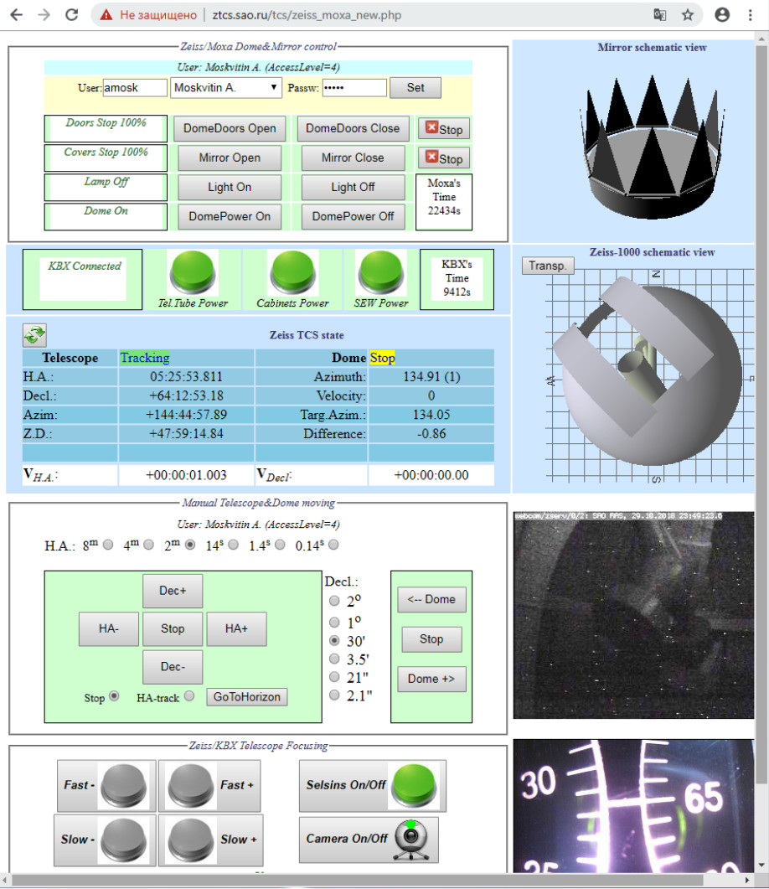

# Руководство наблюдений с ПЗС-фотометром телескопа Цейсс-1000

## Подготовка к наблюдениям. 

[Далее: наведение телескопа и получение изображений в Dina System](Expos.md)

[Назад: последовательность проведения наблюдений](Sequence.md)

[Вверх: на стартовую страницу](index.md)

**Установка/снятие, а также обслуживание ПЗС-фотометра производится только специализированным персоналом!**
После установки ПЗС-фотометра  на телескоп наблюдателю необходимо до наступления ночи провести проверку оборудования. 
В случае обнаружения неисправностей необходимо сообщить о них ответственному за техническое состояние, 
либо соответствующему специалисту для предпринятия срочных мер по восстановлению работоспособности наблюдательного комплекса
(см. [контакты ответственных за состояние Цейсс-1000/ПЗС-фотометра](Contacts.md)).
      
      
**Заблаговременно подготовиться к наблюдениям! К моменту получения плоских полей и других калибровок система должна быть настроена к работе.**
       

      
*Необходимые для запуска программ иконки на рабочем столе.  *
*1 -- BTA TCS Web-site, запускает веб-страницу контроля состояния погоды, камеры всего неба и подсмотр подкупольного телескопов.*
*2 -- Xming приложение, необходимое для работы других программ.      *
*3, 4 -- Run Sjphone on ZTCS и 3CX Phone, необходимы для звукового сопровождения наблюдений.   *
*5 -- Dome, Light, Mirror, Focus, веб-страница управления куполом и несколькими важными параметрами телескопа.  *
*6 -- ZEISS-GUI OBS, основная программа управления телескопом. *
*7, 8 -- Remote Desktop или Radmin, осуществляют доступ к машине zobs. *
*9 -- gcn_monitor_zeiss, программа слежения за алертами гамма-всплесков.  *
*10 -- Object List, программа, из которой возможно наведение телескопа по заранее сформированному списку объектов.}  *

       
### Проверка погодных условий и начало работы

1. Войти в систему на управляющем компьютере zrobs. 
Если компьютер не включён, включить его. Дождаться загрузки системы и программ автозапуска.

2. **Проверить погодные условия и возможность начать наблюдения.** 
Для этого нужно последовательно выполнить ряд шагов, описанных ниже.

    1. На рабочем столе запустить иконку BTA TCS Online (иконка №1), 
      в браузере откроется страница [tb.sao.ru/tcs/main.html](tb.sao.ru/tcs/main.html)
    2. Открыть вкладки TV --> AllSky, TV --> Zeiss-1000, Meteo --> Today, 
      проверить отсутствие облачности, осадков, тумана, сильного ветра (>10 м/с), избыточной влажности. 
    3. В течение ночи контролировать эти параметры.

*Веб-страница с камерами подкупольного телескопа Цейсс-1000, видом в сторону БТА.*
*Также доступны вкладки с метеоусловиям, камеры всего неба и т.д.*

    
    
3. **Проверить отсутствие заснеженности и обледенения купола.** 
Чтобы избежать излишней нагрузки и выхода из строя двигателей, необходимо оценить с помощью метеоданных и изображений 
с внешней обзорной камеры телескопа (Zeiss-1000 5-th camera Outdoor), не помешает ли снег или обледенение 
движению купола и открытию забрала. Опасная ситуация может сложиться после сильного снегопада.

**В случае неопределённости следует не предпринимать попыток движения купола или открытия забрала,**
**а проконстультироваться с ответственным за техническое состояние.**
    
    

### Звуковой контроль

Стабильность и безаварийность работы во время наблюдений осуществляется приемущественно 
с помощью визуальных средств контроля и управления:
интерактивных схем, камер подсмотра, значений различных параметров состояния купола, телескопа и прибора.
Однако, есть ряд пунктов, не столь очевидных или вовсе незаметных при визуальной инспекции: 
моменты открытия/закрытия забрала (смыкание створок), 
движения телескопа и купола (при выключенном свете в подкупольном), 
срабатывание затвора и вращение колеса фильтров в приборе, 
порывы ветра и некоторые нештатные ситуации.

Для дополнительного контроля как из аппаратной телескопа, так и в режиме удалённых наблюдений 
предусмотрена возможность слышать сигнал о завершении экспозиции с компьютера zobs
и звук с микрофона, установленного в подкупольном пространстве Цейсс-1000.
Непосредственно на телескопе звуковое сопровождение включено всегда. 
Для его организации во время удалённых наблюдений необходимо выполнить следующие действия.

1. Включить колонки и выставить максимальный уровень сигнала (вращением ручки громкости по часовой стрелке), 
  проверить уровень громкости в системном трее Windows (области уведомлений в правой нижней части рабочего стола компьютера zrobs). 
2. Запустить на рабочем столе иконку Xming (иконка №2), если это приложение не запущено. 
В трее должен быть запущен Xming Server.
3. Запустить иконку Run Sjphone on ZTCS (иконка №3).
4. Запустить иконку 3CX Phone (иконка №4), 
  в открывшемся окне выбрать Destination number obs@192.168.3.97, 
  нажать зелёную трубку дозвона и убедиться, что в колонках появился шум.

     
     
### Телескоп и купол

*Веб-форма управления куполом и некоторыми важными функциями телескопа во время наблюдений.*
*Сверху вниз: поля аутентификации, открытия забрала и крышек ГЗ, контроля питания, состояния телескопа и купола, фокусировки.*

1. Для включения питания телескопа и купола, открытия забрала и крышек главного зеркала (ГЗ)
  необходимо запустить иконку Dome, Light, Mirror, Focus на рабочем столе компьютера zrobs (иконка №5). 
  В браузере откроется вкладка управления состоянием телескопа и купола 
  [ztcs.sao.ru/tcs/zeiss_moxa_new.php](ztcs.sao.ru/tcs/zeiss_moxa_new.php)
 
 
 Альтернативно на эту страницу можно выйти с домашней страницы САО [https://www.sao.ru/](https://www.sao.ru/) --> 
  "Цейсс-1000 в реальном времени" (иконка с изображением подкупольного Цейсс-1000 в правой части страницы) --> 
  "Web-интерфейсы TCS Цейсс-1000" --> Управление Телескопом, Куполом, крышками Зеркала.

2. Выбрать пользователя из списка и ввести свой пароль.
  **Пароли раздаются зарегистрированным наблюдателям индивидуально ответственным за тех. состояние.**
3. Проверить включённость большой зелёной круглой кнопки питания на трубе телескопа Tel. Tube Power. 
4. Включить кнопки питания стоек и приводов Cabinets power, SEW Power 
  (в итоге должна гореть зелёным линейка из трёх круглых кнопок). 
  В динамиках должны прозвучать щелчки от включения.
5. Включить питание купола кнопкой DomePower On, проверить статус "Dome On" в окошке слева.
  **Уточнить доступные положения купола у инженера или наблюдателей!**

*Ограничения на положения купола при открытии забрала*

  Проверить правильность ориентации купола перед открытием забрала,
  во время парковки купол должен быть повёрнут в южную сторону (азимут около 30 градусов), 
  открыть крышки забрала кнопкой DomeDoors Open, 
  проверить смену статусов забрала в окошке слева, должен быть последний из них, "Doors Stop 100%". 
  **Во время движения купола забрало должно находиться в одном из крайних положений, либо в открытом, либо в закрытом!**
6. Открыть крышки ГЗ Mirror Open, проверить статус полностью открытых крышек в окошке слева "Covers Stop 100%".
7. **Во время наблюдений свет в подкупольном должен быть выключен** 
(кнопки Light On, Light Off, окно состояния слева от этих кнопок)! 

### Состояние купола в программе ZEISS-GUI OBS

 
1. Запусить на рабочем столе иконку ZEISS-GUI OBS (иконка №6).
2. Для того, чтобы купол наводился независимо на положение объекта, 
  во вкладке Dome, в блоке Mean place установить параметр Align with в положение SkyObject.

*Вкладка ZEISS-GUI OBS для управления куполом.*  

### Подготовка системы управления Dina System

1.  Запустить на рабочем столе иконку Remote Desktop (иконка №7). В открывшемся окне убедиться, 
    что введён адрес [zobs.sao.ru](zobs.sao.ru), нажать кнопку Подключить. 

    Альтернативный доступ  к машине zobs может быть осуществлён через приложение Radmin (иконка №8)).
2. В новом открывшемся окне будет приглашение войти в систему Windows 2000 на машине zobs. 
3. Запустить с рабочего стола zobs иконку программы dina_filters. 
Откроется программа Dina System с настройками фотометрических наблюдений
4. Инициализировать камеру. Меню Camera --> Init Camera (Ctrl + I). 
В блоке Information окошка Exposure Control убедиться, что инициализация прошла корректно и появилось сообщение 
"Initialization has completed successfully".
5. В окошке Temperature проверить значение температуры матрицы, она должна быть около -129 градусов Цельсия, 
в противном случае для проведения наблюдений нужно дождаться указанной температуры. 
Если температура матрицы увеличивается (матрица становится теплее), 
необходима заливка азота (нужно сообщить об этом инженеру АСУ БТА)!

6. С рабочего стола zobs запустить Total Commander (иконка Totalcmd) или FAR 
и создать на диске E: директорию нынешней ночи по шаблону ГГММДД (например, 181024 для ночи 24/25 октября 2018 г.)
7. В программе Dina System, в меню Settings запустить окошко Preferences (Ctrl + P).
8. Установить путь к созданной директории ночи  в графе Aquire Directory.
9. Проверить формат имён файлов в блоке Next file (NameNum.fts). 
   Обычно количество символов в имени Name (num. of symbols) устанавливается равным 5, 
   а количество значащих цифр Num (num. of numerals) равным 3, если не планируется получить более 999 изображений.
   **Важно: если параметр количества значащих цифр установлен равным 2, последующие за 99 кадры будут перезаписывать (удалять) первые кадры ночи!**

При работе с ПЗС-фотометром на телескопе (не удалённо), 
пропускаются шаги сетевого доступа к машинам zobs и ztcs, так как работа производится непосредственно на этих компьютерах.

[Далее: наведение телескопа и получение изображений в Dina System](Expos.md)

[Назад: последовательность проведения наблюдений](Sequence.md)

[Вверх: на стартовую страницу](index.md)
