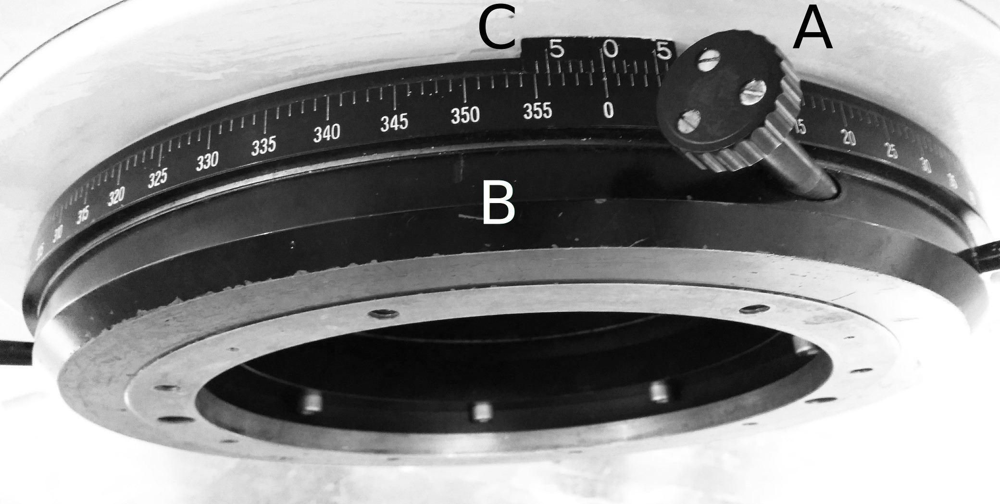
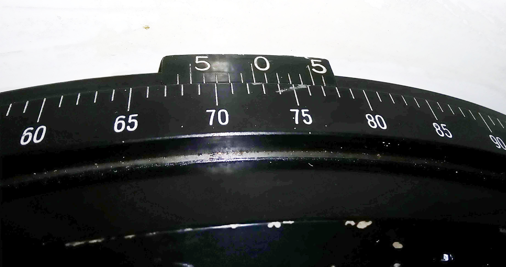
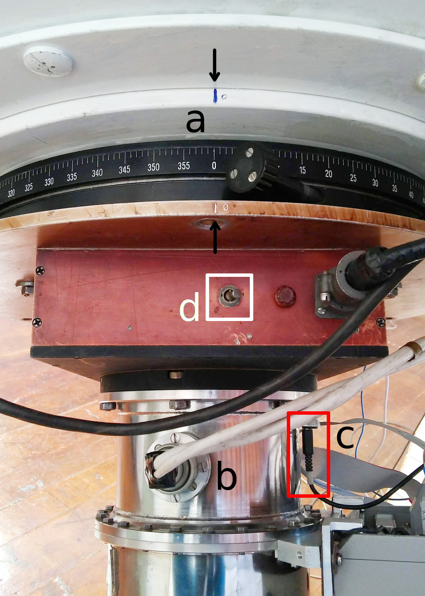
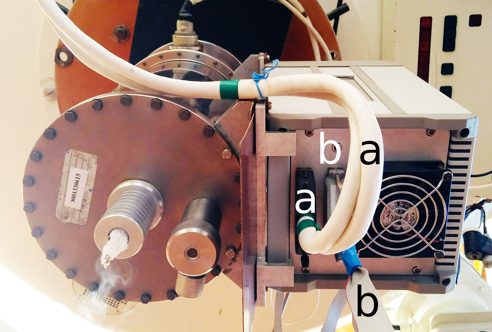
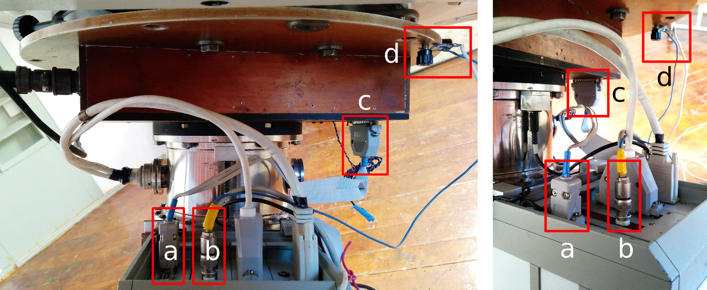
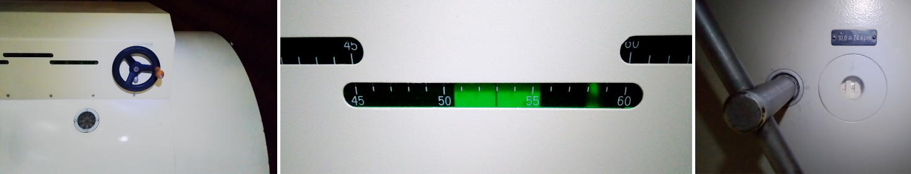
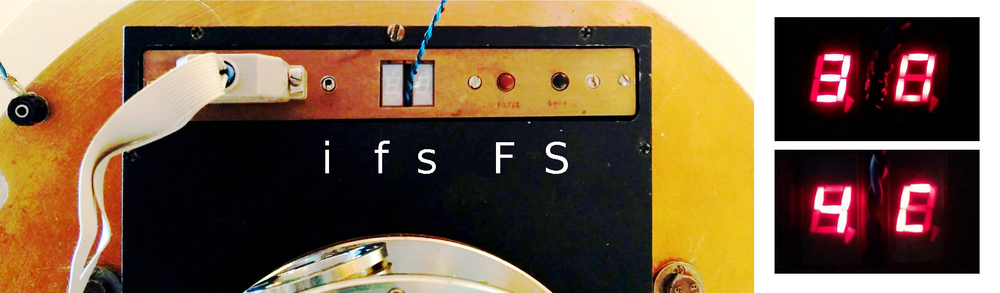
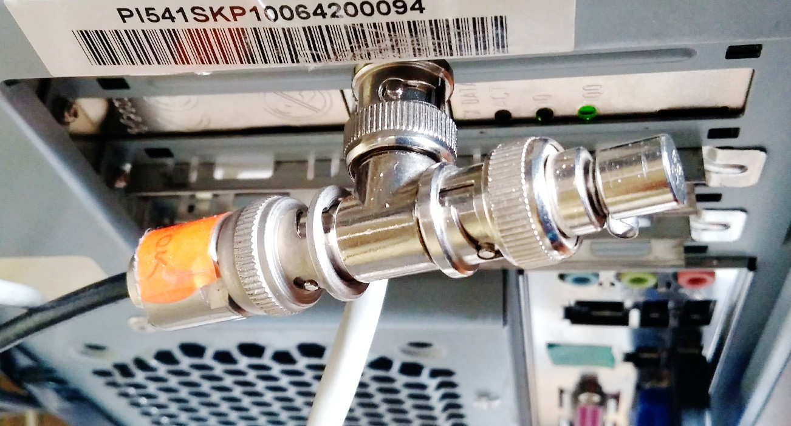

# Техническое руководство для обслуживания ПЗС-фотометра телескопа Цейсс-1000

## Установка фотометра

[Вверх: на стартовую страницу](index.md)

[Далее: тестирование работы фотометра](TestCCDphot.md)

 **Установка/снятие, а также обслуживание ПЗС-фотометра производится только специализированным персоналом!** 

1. Выставить поворотный стол на 72.5 градусов.

Для этого ослабить фиксирующий винт (отмечен как A), держась за ручки повернуть стол (B) до необходимого значения шкалы (C).
Зафиксировать положение винтом A.

*Поворотный стол телескопа Цейсс-1000, общий вид. A -- фиксирующий винт; B -- поворотный стол; C -- шкала.*

*Необходимое значение шкалы для ПЗС-фотометра 72.5 градусов.*

2. Установить фотометр на поворотный стол по синей риске (положение обозначено стрелками и буквой "а"), снять крышку.

*Установка фотометра и ПЗС. а --- положение фотометра относительно синей риски; b --- положение ПЗС; с --- разъём питания подогрева ПЗС; d --- тумблер питания фотометра.*

3.  Установить ПЗС на фотометр (положение обозначено буквой "b" на предыдущем изображении), подключить питание подогрева ПЗС (разъём обозначен буквой "c" и обведён в красную рамку).

4.  Скоммутировать БП ПЗС с Контроллером ПЗС (показан буквой "а").

*Коммутация контроллера ПЗС. a --- кабель от БП ПЗС; b --- кабель-"лапша".*

5.  Скоммутировать контроллер ПЗС и фотометр кабелем-"лапшой" (обозначен буквой "b" на предыдущем изображении, "a, c" на следующем). 
    Скоммутировать кабель Ethernet с разъёмом СР-50 и контроллером ПЗС (обозначен буквой "b" на следующем изображении). 
    Заземлить на фланец фотометра БП ПЗС и контроллер ПЗС (обозначен буквой "d"). 
    

*Коммутация контроллера ПЗС. a, c --- кабель-"лапша"; b --- разъём CP-50; d --- заземление БП ПЗС и контроллера ПЗС.*

6. Подключить питание БП ПЗС и фотометр в блок розеток 220В.

7. Выставить значения балансировки alpha -- 23.7, delta -- 57.

*Левая панель -- ручка баллансировки по углу delta на трубе телескопа;*
*центральная панель -- шкала баллансировки по углу delta; правая --- ключ и шкала баллансировки по углу alpha на противовесе монтировки.*

8. Включить  фотометр (тумблер обозначен буквой "d" на изображении в пункте 2 "Установка фотометра и ПЗС"), проверить работу затвора и передвижение фильтров.

Для этого включить тумблер вкл/выкл индикации (на следующем изображении обозначен буквой "e"), 
с помощью кнопок активации затвора (обозначены буквой "a") и смены фильтра ("b") и проверить, меняются ли индикация ("c, d").
Для этого включить тумблер индикации ("i"), с помощью кнопок смены фильтра ("F")  и активации затвора ("S") проверить меняются ли индикация ("f, s"). 

**Выключить тумблер индикации!**

*Панель контроля ПЗС фотометра. i -- тумблер вкл/выкл индикации; f -- индикация колеса фильтров; s -- индикация состояния затвора; F -- кнопка смены фильтров; S -- кнопка открытия/закрытия затвора. *
*Справа показан пример индикации смены фильтра и состояния затвора.*

9.  Включить БП ПЗС.
10.  Залить азот (после 1--й кружки перерыв 20 -- 30 минут).
11.  Проверить подключение коаксиального кабеля Ethernet и компьютера zobs в аппаратной (тройник с красной биркой).

*Разъём коаксиального сетевого кабеля компьютера zobs.*

[Вверх: на стартовую страницу](index.md)

[Далее: тестирование работы фотометра](TestCCDphot.md)
