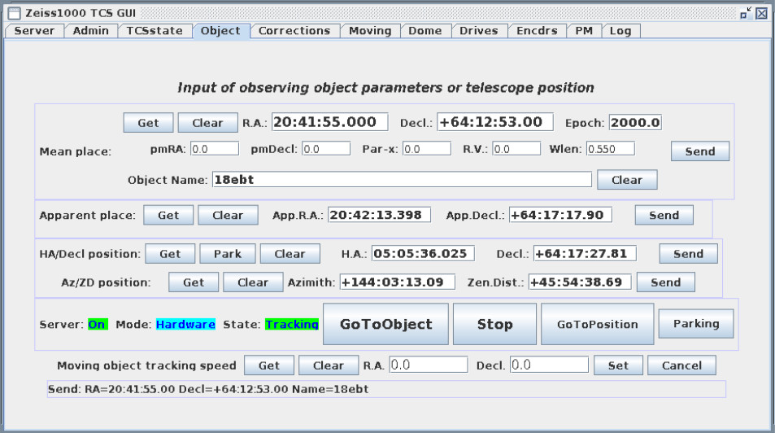
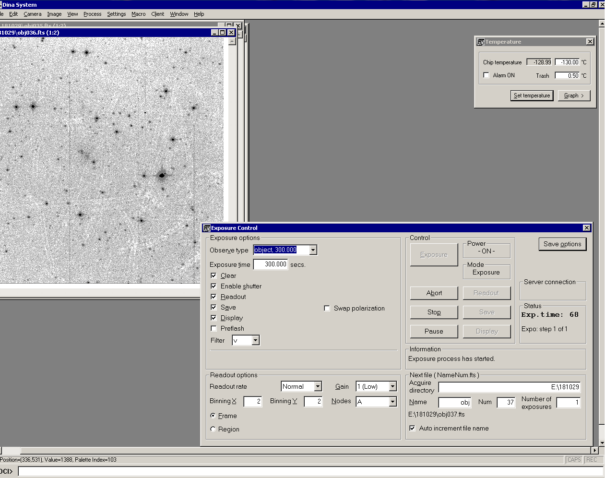

# Руководство наблюдений с ПЗС-фотометром телескопа Цейсс-1000

## Наведение телескопа и получение изображений в Dina System

[Далее: кадры электронного нуля и темнового тока](BiasDark.md)

[Назад: подготовка к наблюдениям](Pre.md) 

[Вверх: на стартовую страницу](index.md)

## Наведение телескопа на объект в программе ZEISS-GUI OBS

*Основная вкладка программы управления телескопом ZEISS-GUI OBS.*
*Поля ввода координат, кнопки запуска, остановки, парковки телескопа и другие органы управления.*

Подробные рекомендации по управлению телескопом из программы ZEISS-GUI OBS 
описаны в [руководстве В. С. Шергина](https://www.sao.ru/hq/vsher/vsher_ru.php).
 
Для наведения телескопа на объект по известным координатам объекта R.A., Decl. необходимо выполнить ряд действий.

1. Во вкладке Object программы ZEISS-GUI OBS ввести координаты объекта, эпоху и имя в полях R.A., Decl., Epoch, Object Name.
2. Нажать кнопку Send этого блока рядом с введёнными параметами объекта.
3. Запустить наведение большой кнопкой GoToObject. В динамиках должен появиться звук двигающегося телескопа и купола. 
  На изображениях и схемах подкупольного пространства должно отражаться состояние телескопа (Slewing) и купола (Move).
  Во вкладке TCSstate программы Zeiss1000 TCS GUI будут изменяться показания положения телескопа, купола и 
  рассогласование между введёнными и текущими координатами.
4. После наведения телескоп должен перейти в режим часового ведения (статус Tracking), а купол -- остановиться (стутус Stop). 
  При этом рассогласование между введёнными и реальными координатами объекта должно быть порядка или менее 1". 
  Для купола аналогичная величина может достигать полутора градусов, после чего произойдёт коррекция положения.

**При нестандартных ситуациях нажать большую кнопку Stop, а потом разбираться с причинами!**

### Получение кадров в Dina System

*Окно программы Dina System. Удалённое подключение к машине zobs с запущенной программой Dina System.*
*Под основным меню открыты окна с полученными за ночь кадрами, контроля температуры ПЗС,*
*управления экспозицией и настройками камеры. Ниже расположена строка отображения координат курсора (Position)*
*и значения потока (Value), ещё ниже командная строка ввода макросов.*

Для получения данных необходимо проверить и настроить параметры кадров.

1. Заполнить параметры шапки FITS файлов Camera --> Change Current FITS Header, 
в открывшемся окошке ввести как минимум имя объекта. 

2. В окошке Exposure Control выставить параметры получаемого кадра.

    1. выбрать тип кадра Observe type (object, flat, bias, dark);
    2. установить время экспозиции Exposure time; 
    3. выбрать фильтр (n, u, b, v, r, i), 
    что соответствует изображению без фильтра и фильтрам системы Джонсона-Коузинса U, B, V, Rc, Ic;
    4. установить параметры считывания Readout rate: Normal, Gain: Low, Binning X: 2, Binning Y: 2 
              (обычно получают кадры с бинированием пикселей 2 x 2), 
              Nodes: A, установить считывание всего изображения, а не части 
              (точка должна стоять в положении Frame, а не Region);
    5. В блоке Next file (NameNum.fts) ввести название Name (obj, flat, bias, dark, ...), номер файла Num (начиная с 1), 
              количество кадров в серии Number of exposures (1 для одиночных кадров), 
              проверить правильность имени файла и рабочей директории,
              а также включённость автоматической нумерации (наличие галочки параметра Auto increment file name).
    6. Нажать кнопку Exposure в блоке Control. После этого система выставит нужный фильтр, 
              откроет затвор, если это требуется и запустит обратный отсчёт экспозиции. 
              Подобные действия могут быть различимы как слабые щелчки в динамиках.
    7. После окончания экспозиции система закроет затвор (если он открывался) 
              и начнёт считывание кадра (что занимает несколько десятков секунд и отображается в процентах), 
              затем полученное изображение откроется в новом окошке.
              
3. Настроить уровни отображения полученного кадра (если настройки по-умолчанию не устраивают), 
         для этого выделить небольшую область кадра левой кнопкой мыши, 
         нажать правую кнопку мыши и в контекстном меню выбрать Histeq.

4. Убедиться, что полученный кадр соответствует ожидаемым настройкам: наличие шума 
         (а не пустой кадр с уровнем в 100 отсчётов по полю), характерные признаки, 
         присущие выбранным типу кадра и экспозиции, наличие и правильное положение звёзд поля.

         
### Быстрый анализ изображений в Dina System         

В наблюдательном процессе востребованы следующие функциии контекстного меню Dina System.

1. Увеличение/уменьшение кадра (Zoom In, Zoom Out) доступно в контекстном меню по щелчку на изображении правой кнопкой мыши.
         (Если открыто много изображений, функция перестаёт работать.)

2. Настройка уровней отображения изображений (cuts). Применяется, если вид полученного кадра не устраивает наблюдателя.
         Выделяется область на кадре, щелчком правой кнопки мыши вызывается контекстное меню, 
         выбирается параметр Histeq (можно попробовать и другие функции отображения Linear, Log, Sqrt).

3. Анализ объекта на кадре и качества изображений. 
	 Для оценки качества изображений (FWHM) в Dina System нужно выделить интересующий объект
         (навести курсор мыши левее и выше звезды, нажать левую кнопку мыши, и, не отпуская её, 
         протянуть курсор в положение правее и ниже звезды, выделив небольшую прямоугольную область). 
         С помощью правой кнопки мыши вызвать контекстное меню, в нём выбрать пункт Object Analysis, 
         в открывшемся окне посмотреть параметр FWHM (полная ширина на половине высоты профиля звезды, выраженная в пикселях). 
         Желательно оценить качество изображений по нескольким звёздам поля.
         Кроме качества изображений Object Analysis приводит значения центра вписанной гауссианы, 
         параметры вписанного эллипса, интегральный поток от объекта и другие характеристики.

4. Пункт контекстного меню Statistics позволяет посмотреть такие характеристики выделенной на кадре области, как количество пикселей, 
         максимальный и минимальный уровни потока, средний уровень, дисперсию, стандартное отклонение и другие статистические данные.

5. Выделив узкую полосу (горизонтальную или вертикальную), пересекающую интересующий объект, 
можно построить разрез данной области через соответствующие пункты контекстного меню Full Horizontal/Vertical Profile in region.

6. Более подробную информацию можно получить в системе помощи программы или изучив [документацию](add/DSman.pdf), 
предоставленную [Лабораторией перспективных разработок САО РАН](https://www.sao.ru/hq/adlab).

[Далее: кадры электронного нуля и темнового тока](BiasDark.md)

[Назад: подготовка к наблюдениям](Pre.md) 

[Вверх: на стартовую страницу](index.md)

