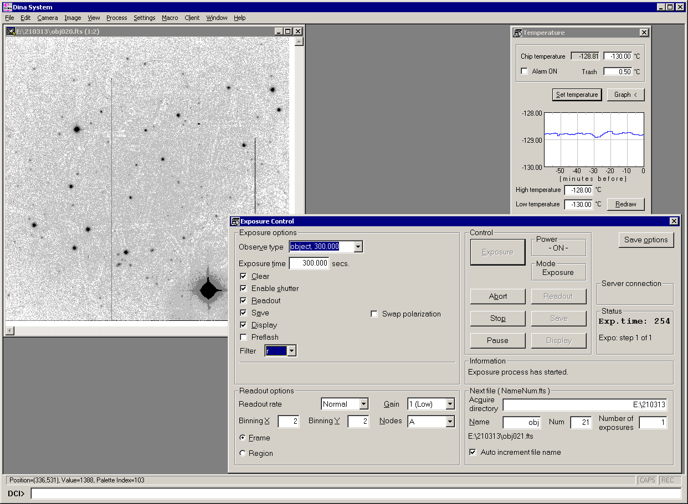
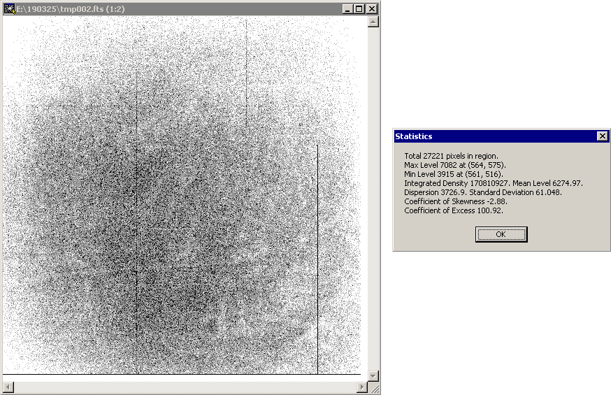

# Техническое руководство для обслуживания ПЗС-фотометра телескопа Цейсс-1000

## Тестирование работы фотометра

[Далее: управление телескопом из подкупольного пространства](InDomeControl.md)

[Назад: установка ПЗС-фотометра](Setupv3.md)

[Вверх: на стартовую страницу](index.md)

1. В аппаратной телескопа Цейсс-1000 запустить компьютер zobs, если он выключен, дождаться загрузки и приглашения выбора пользователя в Windows 2000.

 
2. Войти в систему (логин и пароль см. в документе "Список паролей Цейсс-1000"), дождаться её окончательной загрузки, а также программ автозапуска (в частности NetTime).

3. Запустить с рабочего стола zobs иконку программы dina filters. Откроется программа Dina System с настройками фотометрических наблюдений

4. Инициализировать камеру. Меню Camera --> Init Camera (или Ctrl + I). 
В блоке Information окошка Exposure Control убедиться, что инициализация прошла корректно и появилось сообщение  "Initialization has completed successfully".

5. В окошке Temperature проверить значение температуры камеры, она должна быть около -129 градусов Цельсия, 
для корректной работы оборудования необходимо дождаться указанной температуры. Если температура будет выше указанной, тестовые кадры получить возможно, однако они будут содержать избыточные тепловые шумы.
По мере выхода прибора на режим скорее всего потребуется повторная инициализация камеры.

6. С рабочего стола zobs запустить Total Commander (иконка Totalcmd) или FAR 
и создать на диске E: директорию нынешней ночи по шаблону ГГММДД (например, 181024 для ночи 24/25 октября 2018 г.)

7. В программе Dina System, в меню Settings запустить окошко Preferences (Ctrl + P).
Установить путь к созданной директории ночи  в графе Aquire Directory (для указанного примера E:\181024 ).

8. В окошке Exposure Control выставить параметры тестового кадра:
выбрать тип кадра Observe type: object, выставить время экспозиции несколько секунд,
в блоке Next file ввести название tmp, номер файла Num: 1, количество кадров в серии Number of exposures: 1, проверить правильность имени файла и рабочей директории.

9. Нажать кнопку Exposure в блоке Control. После этого система запустит обратный отсчёт экспозиции, а после начнёт считывание кадра (что занимает несколько десятков секунд и отображается в процентах). 
Полученное изображение откроется в новом окошке.

10. Настроить комфортные уровни отображения полученного кадра (если настройки по-умолчанию не устраивают), 
для этого выделить небольшую область кадра левой кнопкой мыши, нажать правую кнопку мыши и в контекстном меню выбрать Histeq.

11. Убедиться, что полученный кадр корректен: на кадре присутствует естественный шум, значения меняются от пикселя к пикселю. 
Если в подкупольном было мало света и/или экспозиция была короткой тестовый кадр будет похож на кадр электронного нуля.
Если свет был включён, то за несколько десятков секунд уровень сигнала будет заметно больше сотни отсчётов.

         
12. Если в процессе выхода прибора на рабочий режим получается кадр с уровнем **ровно** 100 отсчётов по всему полю и без естественного шума, нужно ещё раз инициализировать камеру.

[Далее: управление телескопом из подкупольного пространства](InDomeControl.md)

[Назад: установка ПЗС-фотометра](Setupv3.md)

[Вверх: на стартовую страницу](index.md)