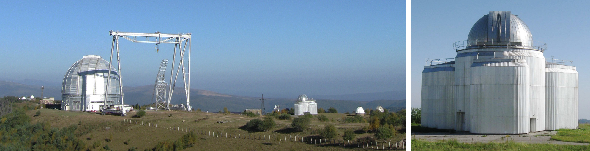

 

# Телескоп Цейсс-1000

[Телескоп Цейсс-1000](https://www.sao.ru/Doc-k8/Telescopes/small/descrip.html) 
системы Ричи-Кретьена-кудэ
расположен на верхней научной площадке САО РАН рядом с 6-метровым телескопом. 
Для установки научного оборудования на Цейсс-1000 доступны фокус Кассегрена 
(фокусное расстояние 13.3 м) и фокус кудэ (36.5 м).
Телескоп работает с 1989 года.
[Оснащён](https://www.sao.ru/Doc-k8/Science/Public/Bulletin/Vol75/N4/ASPB547.pdf)
штатными приборами: 
[ПЗС-фотометром, спектрографом UAGS, спектрографом фокуса куде (CEGS)](https://www.sao.ru/Doc-k8/Telescopes/small/instrum.html), 
а также авторскими MAGIC и MaNGaL.

## Руководство наблюдений с ПЗС-фотометром телескопа Цейсс-1000

Версия 4.2, февраль 2021 г. Ответственный за метод: А. С. Москвитин.

1. [Описание ПЗС-фотометра](CCDphot_v4.md)

2. [Доступ к управлению телескопом и ПЗС-фотометром](Access.md)

3. [Последовательность проведения наблюдений](Sequence.md)

4. [Подготовка к наблюдениям](Pre.md) 

5. [Наведение телескопа и получение изображений в Dina System](SlewExp.md) 

6. [Кадры электронного нуля и темнового тока](BiasDark.md)

7. [Кадры плоского поля](Flats.md)

8. [Фокусировка телескопа](Focus.md)

9. [Завершение наблюдений](Final.md)

10. [Заполнение электронного журнала](EJ.md)

11. [Управление питанием, нештатные ситуации](Neshtat.md)

12. [Дополнительная информация](AddInfo.md)

## Техническое руководство для обслуживания ПЗС-фотометра телескопа Цейсс-1000

1. [Установка ПЗС-фотометра](Setupv3.md)

2. [Тестирование работы фотометра](TestCCDphot.md)

3. [Управление телескопом из подкупольного пространства](InDomeControl.md)

4. [Заливка азота](Azot.md)
